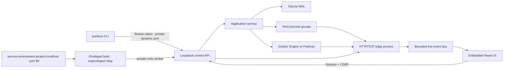

# Portless

Portless is a local application-environment control plane. A project describes an application that may span several repositories; each environment chooses where every component comes from and runs without fixed host ports. The browser UI lets you inspect services, watch traffic, record a reproduction, and introduce scoped failures.

There is no required `portless.yaml`, Docker Compose project, account, or hosted control plane.

```text
cd billing
portless setup  # one time per machine
portless up

# Portless discovers billing/local, starts it, then opens:
http://portless.localhost/environments/billing/local
```

Application ingress is stable and readable:

```text
http://checkout.local.billing.localhost
http://orders.local.billing.localhost
```

Processes, Postgres, and Valkey receive dynamically allocated loopback ports. Two checkouts can both have a service named `postgres`, both listen on their framework's usual port internally, and still run at once.

## What is implemented

- One lazily started, machine-local Go daemon with an authenticated installation/instance/build handshake, plus one native Cobra CLI executable with generated nested help and shell completion.
- Static Spring Boot/Gradle and NestJS discovery across one or many repositories, with Postgres and Redis-compatible hints.
- Reusable projects with independently runnable environments, per-environment checkout paths, and local, managed-container, or remote HTTP(S) providers.
- Explicit remote classification and write policy; read-only targets reject unsafe methods before traffic leaves the machine.
- Readable project and service names throughout the CLI, API, URLs, and UI; immutable ownership keys remain private.
- Persistent per-service supervisors, dynamic ports, HTTP/TCP readiness, bounded structured process/container logs, dependency-aware environment and individual-service lifecycle, daemon-crash reconciliation, and durable operations.
- Direct Docker Engine or Podman networks, volumes, Postgres 17, and Valkey 8 with generated local credentials. Docker Compose is not used.
- Stable `.localhost` application ingress and per-edge HTTP/TCP proxies.
- Unified, filtered HTTP/TCP traffic inspection with redacted request/response headers and durable detail lookup through recordings.
- Named, bounded local recordings and JSON export.
- Named fault rules for latency, jitter, HTTP status, abort, probability, method/path scope, and automatic expiry.
- SQLite WAL state, project timeline, CLI bearer auth, one-use browser claims, session cookies, CSRF, Origin checks, and strict control/application Host separation.
- An embedded React/TypeScript control plane styled as a dense local operations console.

See [docs/implementation-status.md](docs/implementation-status.md) for the explicit boundary of this initial implementation.

## Build

Requirements for building Portless:

- Go 1.26 or newer.
- Node.js and npm for compiling the embedded UI.
- macOS or Linux.

Requirements for running discovered environments depend on the checkout. Docker Engine or Podman is needed only when Portless discovers managed container dependencies.

```bash
make
./bin/portless --version
```

`make` is the complete build entry point. On a clean checkout it installs the
locked frontend development dependencies, compiles the embedded React UI, and
then compiles the Go executable. Later builds reuse `web/node_modules` until a
frontend manifest changes.

The Vite build is written to `webui/dist` and embedded by Go. The resulting `bin/portless` does not need Node.js to serve the UI.

## First run

1. Run `portless setup` once. It asks for administrator approval to install a minimal localhost-only port-80 relay, then immediately drops to your user account. `portless relay install` is the explicit equivalent.
2. Install and start Docker Engine or Podman if the project needs Postgres or Redis-compatible storage.
3. Enter a Spring Boot or NestJS repository.
4. Run `portless up` to discover and start its `local` environment.
5. Use the browser dashboard to inspect and control the running environment.

`portless env rescan` refreshes every source in the selected environment while it is stopped. The next `portless up` uses the refreshed model immediately.

`portless setup` and `portless relay install` are idempotent. On macOS they install a root-owned launchd job; on systemd Linux they install an equivalent unit. The helper owns only `127.0.0.1:80`, drops privileges before accepting traffic, and cannot inspect or control projects independently of the user daemon. If another program already owns local port 80, installation stops with that conflict instead of replacing it. A root-owned receipt records which local user and private socket own the machine-wide relay.

The daemon creates `~/.portless` and its private runtime directories with mode `0700`. When opening an existing data directory, it rejects files and symlinks, verifies ownership, and restores mode `0700` before reading daemon state.

Useful commands:

```text
portless status
portless daemon status
portless daemon stop
portless daemon restart
portless relay status
portless relay restart
portless doctor
portless config color
portless config color auto
portless config color always
portless config color never
portless config reset
portless reset
portless reset --yes
portless env list
portless env select billing/local
portless env current
portless env clear
portless --env billing/qa status
portless open [service]
portless url [service]
portless logs [service] --tail
portless traffic list --service checkout --tail
portless traffic list --edge checkout:orders --protocol http
portless traffic show 42

portless project list
portless project show [project]
portless service list
portless service show checkout
portless service config checkout
portless service restart checkout
portless connection list
portless connection show checkout:orders
portless timeline

portless runtime status
portless runtime use auto
portless runtime use docker
portless runtime use podman

portless record start checkout-debug --edge checkout:orders
portless record stop checkout-debug
portless record show checkout-debug
portless record export checkout-debug --output checkout-debug.json

portless fault add slow-orders checkout:orders --latency 2000
portless fault add fail-payments checkout:payments --status 503
portless fault show slow-orders
portless fault clear

portless down
portless down --volumes --yes
```

Every command and subcommand has generated help, for example `portless env bind --help`. Cobra also generates completion scripts for Bash, Zsh, Fish, and PowerShell:

```bash
portless completion --help
source <(portless completion zsh)
```

When the daemon is already running, completion includes current projects, environments, services, connections, traffic sequences, recordings, faults, and sources. Completion never starts or replaces a daemon and silently falls back to static command completion when state is unavailable.

Human-readable output is the default across the CLI. Add the global `--json` flag before or after a subcommand for scripting; streaming commands emit JSON Lines. Bounded list commands expose `--limit`, and logs also support `--since`, `--timestamps`, and `--tail`.

CLI color defaults to `auto`, which uses a restrained status palette only when output is going to an interactive terminal. `portless config color always` or `portless config color never` saves a machine-local preference in `~/.portless/preferences.json`; `portless config color auto` restores terminal detection. `portless config reset` removes all saved CLI preferences and restores their built-in defaults. The global `--no-color` flag and the `NO_COLOR` environment variable override the saved preference for one invocation. JSON, redirected output in `auto` mode, and generated completion scripts never contain ANSI color codes.

Ordinary `down` preserves managed volumes, history, logs, and recordings. Volume removal requires the separate destructive flag and confirmation.

`portless reset` previews a machine-wide application-state reset and does not change anything. `portless reset --yes` requires every environment to be stopped, removes all projects, environments, traffic, recordings, faults, timelines, service logs, generated credentials, and every Portless-owned container, network, database volume, and cache volume from each container runtime Portless has used. It then restarts the daemon with an empty database. If a previously used runtime is unavailable, reset stops before erasing the ownership records so it can be retried safely. CLI preferences, the selected runtime, installation identity, authentication, and the privileged localhost relay installation are preserved. Use `portless config reset` instead when only CLI preferences should return to their defaults.

Logs from both host processes and managed containers are stored as structured entries. Portless retains the newest 10 generations for each service and caps each generation's stdout and stderr stream at 16 MiB, so a noisy local service cannot grow storage without bound.

## Manage the privileged relay

`portless setup` is only the guided first-run shortcut. Ongoing relay lifecycle commands live under the `relay` resource:

```bash
portless relay install
portless relay status
portless relay status --json
portless relay restart
portless relay restart --json
portless relay uninstall
```

Restart verifies that the relay belongs to the current user before requesting administrator approval. It restarts only the fixed Portless launchd or systemd service, starts the user daemon when needed, and waits for the clean URL to pass an end-to-end health check.

Uninstall is idempotent and avoids requesting administrator approval when the relay is already absent. It unloads the launchd or systemd service and removes only its fixed service configuration, copied helper executable, and installation receipt. Projects, environments, running processes, containers, volumes, recordings, and `~/.portless` remain untouched. Their clean localhost URLs are unavailable until `portless relay install` or `portless setup` is run again.

The relay is machine-wide. Portless refuses to restart or remove an installation owned by another user—or one whose ownership cannot be established. Removal can be forced with `portless relay uninstall --force`; restart deliberately has no force option. The privileged subprocess accepts no user-controlled service names or filesystem paths.

## Diagnose the local installation

`portless doctor` performs read-only checks across the daemon, clean-URL relay, `.localhost` resolution, port 80, and the available Docker/Podman runtimes. It does not start services, invoke `sudo`, change runtime selection, or repair anything.

```bash
portless doctor
portless doctor daemon
portless doctor relay
portless doctor runtime
portless doctor --json
```

Every check includes a stable code. Failed checks and warnings include specific remediation; informational checks capture useful platform behavior that requires no action. Human output is grouped by component, and JSON contains the same checks for scripts and bug reports. The command exits with status 1 when a required check fails, status 0 when there are only passes, informational results, or warnings, and status 2 for invalid command usage.

Every API-using CLI command authenticates the daemon before using it. The daemon reports a stable installation fingerprint, a random per-start instance fingerprint, the API/lifecycle protocol versions, and a hash of the exact executable that started it. Those values must match the private control record and the current CLI build. The daemon also watches its executable for replacement. An authenticated older build replaces itself automatically when every active service, container, ingress target, and dependency-listener port can be handed off safely. An identity or ownership mismatch fails closed instead of trusting stale state, launching duplicate services, or signaling an unverified PID.

Local application processes are children of small authenticated Portless supervisors rather than the daemon itself. On daemon restart, Portless reattaches to those supervisors, adopts managed containers by installation/environment/service/generation labels, restores dependency proxies on their original injected ports, then republishes ingress. Services remain in `recovering` until that verification completes. A known process exit remains `exited` or `failed`; a runtime that cannot prove its identity becomes `unknown`.

Explicit lifecycle controls are available when needed:

```bash
portless daemon status
portless daemon status --json
portless daemon stop
portless daemon restart
```

`stop` refuses to abandon active environments. `restart` performs an authenticated handoff and keeps supervised processes and managed containers running; it refuses when any runtime or saved proxy port cannot be verified. `--force` bypasses that guard and is also the migration path for a legacy daemon that predates the authenticated lifecycle endpoint. Before the legacy fallback sends a signal, it verifies that the private record still points to a process owned by the current user whose command is a Portless daemon for the same data directory. Forced replacement can leave an unprovable runtime in `unknown`, so it remains an explicit recovery action rather than the normal workflow.

## Projects spanning several repositories

Create the project once by naming each source checkout. Portless statically discovers every source, merges their services, and resolves references such as `PAYMENTS_URL` against services found in the other repositories.

```bash
portless project create billing \
  --source checkout=../checkout-service \
  --source payments=../payments-service \
  --source notifications=../notifications-service

portless env select billing/local
portless up
```

The initial `local` environment runs all application services from those checkouts and manages discovered Postgres/Valkey dependencies directly through Docker or Podman.

Clone an environment when you want a different composition. Cloning copies configuration, not runtime state or data volumes, and does not require the source environment to stop:

```bash
portless env clone qa-assisted --from local
portless env select billing/qa-assisted

# Keep checkout and notifications local, but route payments to QA.
portless env bind payments --remote https://payments.qa.example.com \
  --classification qa --write-policy read-only --health-path /health

portless up
```

All HTTP traffic to the remote dependency still crosses the environment proxy, so traffic inspection, recording, and faults work across that boundary. A read-only binding blocks `POST`, `PUT`, `PATCH`, and `DELETE` locally. Restore the local implementation with `portless env bind payments --local payments`.

Two environments cannot safely launch processes from the same checkout simultaneously. Point one environment at a Git worktree, then run both:

```bash
git -C ../payments-service worktree add ../payments-experiment experiment
portless env source payments --path ../payments-experiment
```

From any project source directory, `portless env select billing/qa-assisted` saves that environment as the context for the checkout. Commands such as `up`, `down`, `status`, `logs`, `traffic`, `record`, `fault`, and environment configuration then use it automatically. `portless env current` shows the effective environment and whether it came from a saved selection or was inferred because only one environment uses the checkout. `portless env clear` removes only the saved selection.

Use the global `--env` flag for a one-command override without changing the checkout selection:

```bash
portless --env billing/local status
portless --env billing/local logs checkout --tail
portless --env billing/qa up
```

## No mandatory project file

Portless starts with static discovery. It reads supported build manifests and example environment files; it never runs a Gradle task or package script during discovery. The discovered model is kept in the user-private SQLite database.

When a team wants a shareable declaration, this is additive rather than required:

```bash
portless project export
# writes portless.project.json
```

## Public naming model

Projects are identified by a machine-local DNS name such as `billing`. Environments are named within a project, and services are named within that reusable topology. Recordings, fault rules, operations, and traffic belong to one environment.

```text
GET  /api/v1/projects/billing
GET  /api/v1/environments/billing/qa-assisted
POST /api/v1/environments/billing/qa-assisted/services/orders/restart
GET  /api/v1/environments/billing/qa-assisted/recordings/checkout-debug/export
```

SQLite and the selected container engine keep ownership details private so project and environment renames cannot weaken cleanup safety.

## Architecture



The control API is served only for `localhost`, `127.0.0.1`, `::1`, and `portless.localhost`. An application Host is routed directly to ingress and receives `421` for `/api/...`, even on the same listener.

State defaults to `~/.portless`. Set `PORTLESS_HOME` to isolate development or test instances.

## Develop and test

```bash
make test
make

# Exercise discovery against the included small environment:
cd examples/store
portless up --no-open
portless ui
```

Tests cover the Cobra command tree and completion, naming and non-leakage, multi-source compilation, isolated environment state, provider and worktree switching, SQLite idempotency, browser claims and CSRF, dependency pruning and ordering, process lifecycle, control/application host isolation, remote read-only enforcement, proxy traffic redaction, recording persistence, and fault application.

API reference: [api/openapi.yaml](api/openapi.yaml). Live event contract: [api/events.md](api/events.md).
