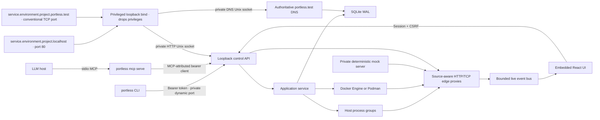

# Portless

Portless is a local application-environment control plane. A project describes an application that may span several repositories; each environment chooses where every component comes from and runs without fixed host ports. The browser UI lets you inspect services, watch traffic, record a reproduction, introduce scoped failures, and replace an HTTP dependency with deterministic local responses.

There is no required `portless.yaml`, Docker Compose project, account, or hosted control plane.

```text
cd billing
portless setup  # one time per machine
portless up

# Portless discovers billing/local, starts it, then opens:
http://portless.localhost/environments/billing/local
```

Application ingress is stable and readable:

```text
http://checkout.local.billing.localhost
http://orders.local.billing.localhost
```

TCP services also have stable DNS endpoints on their conventional ports:

```text
postgres.local.billing.portless.test:5432
redis.local.billing.portless.test:6379
```

Processes and managed resource containers still receive private dynamic runtime ports. Portless allocates a distinct loopback IP to each public TCP endpoint and each directed service connection, so multiple projects can all expose conventional resource ports without conflicts. A process receives a source-aware name such as `postgres.via-orders.local.billing.portless.test`; this preserves the exact caller for traffic, recordings, and faults. The first release reserves 64 such endpoint addresses across the installation and rejects a configuration atomically if that pool is exhausted.

## What is implemented

- One lazily started, machine-local Go daemon with an authenticated installation/instance/build handshake, plus one native Cobra CLI executable with generated nested help and shell completion.
- Bounded, plugin-driven framework discovery for Spring Boot (Gradle and Maven), NestJS, Express, Fastify, Next.js, Go HTTP/RPC services, and FastAPI.
- A separate managed-resource plugin registry in which each plugin owns static detection, declarative container provisioning, readiness, credentials, and process bindings. The built-in registry supports PostgreSQL 17, Valkey 8, MySQL 8.4, and NATS 2.
- Reusable projects with independently runnable environments, per-environment checkout paths, and local, managed-container, remote HTTP(S), or deterministic mock providers.
- Explicit remote classification and write policy; read-only targets reject unsafe methods before traffic leaves the machine.
- Readable project and service names throughout the CLI, API, URLs, and UI; immutable ownership keys remain private.
- Persistent per-service supervisors, dynamic ports, HTTP/TCP readiness, bounded structured process/container logs, dependency-aware environment and individual-service lifecycle, daemon-crash reconciliation, and durable operations.
- Context-aware debug startup: from a supported service directory, `portless up` starts that service under Portless with its debugger enabled and starts the rest normally.
- Generic declarative Docker Engine or Podman networks, named volumes, generated local credentials, commands, and TCP/exec readiness. Docker Compose is not used.
- Stable `.localhost` HTTP ingress, scoped `.portless.test` TCP DNS, and source-aware per-edge HTTP/TCP proxies.
- Trace-first HTTP/TCP inspection with explicit correlation confidence, expandable service waterfalls, raw exchange mode, exact request targets, repeated request/response headers, bounded body detail, and durable lookup through recordings.
- Named, bounded local recordings with opt-in bounded body capture, JSON export, and mock-profile import.
- Environment-scoped HTTP mock profiles with method, parameterized-path, required-query matching, fixed headers/status/body/delay, preview, OpenAPI import, and service-scoped hot binding.
- Named fault rules for latency, jitter, HTTP status, abort, probability, method/path scope, and optional expiry.
- SQLite WAL state, project timeline, CLI bearer auth, one-use browser claims, session cookies, CSRF, Origin checks, and strict control/application Host separation.
- A workspace-scoped, read-only-by-default MCP server launched as `portless mcp serve`, with separately gated lifecycle, traffic-control, and sensitive-traffic capabilities.
- An embedded React/TypeScript control plane styled as a dense local operations console.

See [docs/implementation-status.md](docs/implementation-status.md) for the explicit boundary of this initial implementation.

## Repository structure

The source tree follows the running product rather than a generic `internal`
layout:

- `portless-cli` owns the `portless` executable and is split by user-facing
  command domains: environment lifecycle, projects, observation, traffic, and
  administration. Its `command` package owns shared CLI execution and output.
- `portless-daemon` owns the daemon, its API, control plane, state, discovery,
  runtimes, and traffic behavior.
- `portless-relay` owns the privileged clean-URL and TCP DNS relay, including
  installation and removal.
- `portless-web` owns the React control plane and the assets embedded into the
  daemon.
- `portless-mcp` owns the local stdio MCP runtime, scoped tool registry,
  capability policy, redaction, and result limits. The CLI consumes it through
  `portless mcp serve`; it is not a separate executable or daemon API.

There is no standalone API product: `portless-daemon/api` is the daemon's wire
boundary shared by the CLI, browser, and MCP adapter. See the
[product structure](docs/plans/package-structure-refactor.md) for ownership and
dependency rules.

## Build

Requirements for building Portless:

- Go 1.26 or newer.
- Node.js and npm for compiling the embedded UI.
- macOS or Linux.

Requirements for running discovered environments depend on the checkout. Docker Engine or Podman is needed only when Portless discovers managed container dependencies.

```bash
make
./bin/portless --version
```

`make` is the complete build entry point. On a clean checkout it installs the
locked frontend development dependencies, compiles the embedded React UI, and
then compiles the Go executable. Later builds reuse
`portless-web/node_modules` until a frontend manifest changes.

The Vite build is written to `portless-web/dist` and embedded directly by the
`portless-web` product. The resulting `bin/portless` does not need Node.js to
serve the UI.

## First run

1. Run `portless setup` once. It asks for administrator approval to install the narrow loopback relay used by clean HTTP URLs and TCP endpoint DNS, then immediately drops to your user account. `portless relay install` is the explicit equivalent.
2. Install and start Docker Engine or Podman if the project needs a managed resource.
3. Enter the directory for the service you are changing.
4. Run `portless up`. Portless discovers the project, starts its dependencies and peer services normally, and starts the current service with a Node inspector or JVM debug endpoint when one can be discovered safely.
5. In your IDE, use **Attach to Process** and choose the matching Node or JVM process; the command prints its debugger type and loopback address. You do not need a Portless-specific run configuration or environment file.
6. Use the browser dashboard to inspect ownership, traffic, recordings, and faults.

`portless env rescan` refreshes every source in the selected environment while it is stopped. The next `portless up` uses the refreshed model immediately.

Run `portless up` from a project root to start every service normally while
preserving any active debug modes. `portless up --debug <service>` selects a
debug-capable service explicitly from any directory. Debug mode is additive:
running `portless up` later from another service directory keeps the first
service running in debug mode and enables the second. `portless service manage
<service>` restarts one service normally; `portless up --managed` restarts every
debug service in normal managed mode. Because Portless owns both modes, daemon
restart and environment shutdown retain deterministic process ownership.

`portless setup` and `portless relay install` are idempotent. On macOS they install a root-owned launchd job and an `/etc/resolver/portless.test` route; on systemd Linux they install an equivalent unit and a routing domain for `systemd-resolved`. The helper binds only `127.0.0.1:80` and UDP/TCP `127.77.0.1:1053`, then drops to the installing user before accepting traffic. The scoped resolver explicitly uses port 1053, avoiding macOS's system-owned wildcard DNS listener on port 53. macOS setup also reserves a bounded `127.77.0.x` loopback pool because Darwin does not make the full `127/8` range bindable by default; Linux already does. Its DNS server is authoritative only for `portless.test` and never forwards unrelated queries, so the machine's normal DNS remains untouched. If an owned address is already in use, installation reports the conflict instead of replacing it. A root-owned receipt records which local user and private HTTP/DNS sockets own the machine-wide relay.

The daemon creates `~/.portless` and its private runtime directories with mode `0700`. When opening an existing data directory, it rejects files and symlinks, verifies ownership, and restores mode `0700` before reading daemon state.

Useful commands:

```text
portless status
portless daemon status
portless daemon stop
portless daemon restart
portless relay status
portless relay restart
portless doctor
portless config color
portless config color auto
portless config color always
portless config color never
portless config reset
portless reset
portless reset --yes
portless reset --force --yes
portless uninstall
portless uninstall --yes
portless uninstall --force --yes
portless env list
portless env select billing/local
portless env current
portless env clear
portless --env billing/qa status
portless up --debug checkout
portless up --managed
portless open [service]
portless url [service]
portless logs [service] --tail
portless traffic list --service checkout --tail
portless traffic list --edge checkout:orders --protocol http
portless traffic show 42
portless traffic traces --service checkout
portless traffic trace 42

portless project list
portless project show [project]
portless service list
portless service show checkout
portless service config checkout
portless service restart checkout
portless service debug checkout
portless service manage checkout
portless connection list
portless connection show checkout:orders
portless timeline

portless runtime status
portless runtime use auto
portless runtime use docker
portless runtime use podman

portless record start checkout-debug --edge checkout:orders
portless record start inventory-cases --edge checkout:inventory --capture-bodies
portless record stop checkout-debug
portless record show checkout-debug
portless record export checkout-debug --output checkout-debug.json

portless mock create sold-out --service inventory
portless mock route set sold-out lookup --path '/inventory/{sku}' \
  --header Content-Type=application/json --body '{"available":false}'
portless mock preview sold-out --path /inventory/coffee-mug
portless env bind inventory --mock sold-out
portless env bind inventory --local inventory

portless fault add slow-orders checkout:orders --latency 2000
portless fault add fail-payments checkout:payments --status 503
portless fault show slow-orders
portless fault clear

portless down
portless down --all
portless down --volumes --yes

portless mcp serve
portless --env billing/local mcp serve
portless mcp serve --allow-lifecycle
```

## Connect an MCP client

Open the control plane with `portless ui`, then choose **Settings → MCP** to
generate a client configuration. The screen can pin the server to one
environment, scope it to a source checkout, or explicitly expose every local
environment. It also shows the exact tool count and warnings for lifecycle,
traffic-control, and sensitive-traffic access before you copy anything.

The control plane does not start or own an MCP process. Your MCP client launches
`portless mcp serve` over stdio from the generated configuration. Capability
choices on the screen are intentionally not saved; access is fixed by the
configuration for the lifetime of that client-owned process.

The default server is read-only and can see only environments associated with
the workspace where the MCP process starts:

```json
{
  "mcpServers": {
    "portless": {
      "command": "portless",
      "args": ["mcp", "serve"]
    }
  }
}
```

Pin access to one environment with `--env billing/local`, or explicitly grant
machine-wide visibility with `--all-environments`. Mutating tools are absent
unless the process starts with `--allow-lifecycle` or
`--allow-traffic-control`. Detailed headers and body prefixes are separately
gated by `--allow-sensitive-traffic`; summaries remain available without it.
These permissions are immutable for the lifetime of the MCP process.

See [docs/mcp.md](docs/mcp.md) for the complete tool inventory, permission
model, client configurations, data-sensitivity boundaries, and troubleshooting.

Every command and subcommand has generated help, for example `portless env bind --help`. Cobra also generates completion scripts for Bash, Zsh, Fish, and PowerShell:

```bash
portless completion --help
source <(portless completion zsh)
```

When the daemon is already running, completion includes current projects, environments, services, connections, traffic sequences, recordings, mock profiles, faults, and sources. Completion never starts or replaces a daemon and silently falls back to static command completion when state is unavailable.

Human-readable output is the default across the CLI. Add the global `--json` flag before or after a subcommand for scripting; streaming commands emit JSON Lines. Bounded list commands expose `--limit`, and logs also support `--since`, `--timestamps`, and `--tail`.

Traffic traces are rebuildable projections over a bounded live exchange window.
They report whether each relationship is exact, inferred, partial, or ambiguous;
Portless does not claim timing inference is certain. Exchange detail retains
repeated non-sensitive headers and up to 64 KiB of inspectable request and
response bodies. Recordings remain metadata-only by default; `record start
--capture-bodies` retains independently bounded request and response prefixes
for that recording and warns that application payloads may contain secrets.
Authorization, cookie, and common API-key/token header values
are replaced with `[REDACTED]` before retention. Bodies and other application
values remain local diagnostic data and can still be sensitive.

CLI color defaults to `auto`, which uses a restrained status palette only when output is going to an interactive terminal. `portless config color always` or `portless config color never` saves a machine-local preference in `~/.portless/preferences.json`; `portless config color auto` restores terminal detection. `portless config reset` removes all saved CLI preferences and restores their built-in defaults. The global `--no-color` flag and the `NO_COLOR` environment variable override the saved preference for one invocation. JSON, redirected output in `auto` mode, and generated completion scripts never contain ANSI color codes.

Ordinary `down` preserves managed volumes, history, logs, and recordings. `portless down --all` ignores checkout ambiguity, requests shutdown for every active environment across all projects, and waits for every accepted operation while reporting all failures together. It cannot be combined with `--env`; add `--no-wait` to return after every shutdown request has been submitted. Volume removal requires the separate destructive flag and confirmation; `portless down --all --volumes --yes` also visits stopped environments so every managed environment volume is removed.

`portless reset` previews a machine-wide application-state reset and does not change anything. `portless reset --yes` requires every environment to be stopped. `portless reset --force --yes` is the explicit recovery path for active, recovering, unknown, or format-incompatible environments: it can first replace an authenticated outdated daemon while leaving runtimes in place, then stops every process supervisor whose private ownership record can be authenticated and removes installation-labeled runtime resources before erasing state. Lifecycle authentication and reset planning use normalized ownership rows rather than the versioned project model, so the reset-and-rediscover path remains available even when ordinary environment commands cannot decode old state. Both confirmed forms remove all projects, environments, traffic, recordings, faults, timelines, service logs, generated credentials, and every Portless-owned container, network, database volume, and cache volume from each container runtime Portless has used, then restart the daemon with an empty database. Force never authorizes killing an unverified process. If a previously used runtime is unavailable or runtime ownership cannot be proven, reset stops before erasing the ownership records so it can be retried safely. CLI preferences, the selected runtime, installation identity, authentication, and the privileged localhost relay installation are preserved. Use `portless config reset` instead when only CLI preferences should return to their defaults.

## Uninstall Portless completely

`portless uninstall` is preview-only. It inventories the daemon, projects and environments when the current daemon is available, privileged relay and resolver, complete data directory, managed runtime cleanup, and the CLI launcher. It never requests administrator approval or changes the machine. The preview prints the exact confirmed command required for the observed state.

`portless uninstall --yes` proceeds only when Portless can verify that every environment is stopped. `portless uninstall --force --yes` is the explicit recovery path for active, recovering, stopped-daemon, or otherwise unavailable inventory. Force still removes only authenticated process supervisors, installation-labeled containers/networks/volumes, and a guarded Portless daemon; it never authorizes an unverified process kill.

Confirmed uninstall is deliberately ordered so cleanup ownership cannot be lost: it purges managed runtimes, removes the privileged HTTP/DNS relay and its `portless.test` resolver/loopback pool, stops the daemon without restarting it, removes the entire configured Portless data directory, and removes the CLI launcher last. A verified launcher symlink is unlinked without deleting its target, so a source-tree `bin/portless` build remains. A regular executable is removed automatically only when it is the running `portless` binary in a recognized CLI install directory; uncertain or source-tree paths are preserved and reported.

The full command will not use `--force` to override relay ownership or remove a relay targeting another Portless data directory. Resolve that exceptional machine-wide ownership case separately with `portless relay status` and, only when intentional, `portless relay uninstall --force`. If runtime cleanup, relay removal, or daemon/data removal fails, later destructive steps are skipped and the remaining ownership state is retained for a safe retry. `--json` provides the same preview and completion result as structured output.

Logs from both host processes and managed containers are stored as structured entries. Portless retains the newest 10 generations for each service and caps each generation's stdout and stderr stream at 16 MiB, so a noisy local service cannot grow storage without bound.

## Manage the privileged relay

`portless setup` is only the guided first-run shortcut. Ongoing relay lifecycle commands live under the `relay` resource:

```bash
portless relay install
portless relay status
portless relay status --json
portless relay restart
portless relay restart --json
portless relay uninstall
```

Restart verifies that the relay belongs to the current user before requesting administrator approval. It restarts only the fixed Portless launchd or systemd service, starts the user daemon when needed, and waits for both HTTP ingress and authoritative TCP endpoint DNS to pass end-to-end health checks.

Uninstall is idempotent and avoids requesting administrator approval when the relay is already absent. It unloads the launchd or systemd service and removes only its fixed service configuration, scoped `portless.test` resolver entry, copied helper executable, and installation receipt. Projects, environments, running processes, containers, volumes, recordings, and `~/.portless` remain untouched. Clean HTTP URLs and TCP DNS names are unavailable until `portless relay install` or `portless setup` is run again.

The relay is machine-wide. Portless refuses to restart or remove an installation owned by another user—or one whose ownership cannot be established. Removal can be forced with `portless relay uninstall --force`; restart deliberately has no force option. The privileged subprocess accepts no user-controlled service names or filesystem paths.

## Diagnose the local installation

`portless doctor` performs read-only checks across the daemon, private HTTP/DNS sockets, `.localhost` resolution, the scoped `portless.test` resolver, HTTP port 80, the dedicated DNS port 1053, and the available Docker/Podman runtimes. It does not start services, invoke `sudo`, change runtime selection, or repair anything.

```bash
portless doctor
portless doctor daemon
portless doctor relay
portless doctor runtime
portless doctor --json
```

Every check includes a stable code. Failed checks and warnings include specific remediation; informational checks capture useful platform behavior that requires no action. Human output is grouped by component, and JSON contains the same checks for scripts and bug reports. The command exits with status 1 when a required check fails, status 0 when there are only passes, informational results, or warnings, and status 2 for invalid command usage.

Every API-using CLI command authenticates the daemon before using it. The daemon reports a stable installation fingerprint, a random per-start instance fingerprint, the API/lifecycle protocol versions, and a hash of the exact executable that started it. Those values must match the private control record and the current CLI build. The daemon also watches its executable for replacement. An authenticated older build replaces itself automatically when every active service, container, ingress target, and dependency-listener port can be handed off safely. An identity or ownership mismatch fails closed instead of trusting stale state, launching duplicate services, or signaling an unverified PID.

Local application processes are children of small authenticated Portless supervisors rather than the daemon itself. On daemon restart, Portless reattaches to those supervisors, adopts managed containers by installation/environment/service/generation labels, restores dependency proxies on their original injected ports, then republishes ingress. Services remain in `recovering` until that verification completes. A known process exit remains `exited` or `failed`; a runtime that cannot prove its identity becomes `unknown`.

Explicit lifecycle controls are available when needed:

```bash
portless daemon status
portless daemon status --json
portless daemon stop
portless daemon restart
```

`stop` refuses to abandon active environments. `restart` performs an authenticated handoff and keeps supervised processes and managed containers running; it refuses when any runtime or saved proxy port cannot be verified. `--force` bypasses that guard and is also the migration path for a legacy daemon that predates the authenticated lifecycle endpoint. Before the legacy fallback sends a signal, it verifies that the private record still points to a process owned by the current user whose command is a Portless daemon for the same data directory. Forced replacement can leave an unprovable runtime in `unknown`, so it remains an explicit recovery action rather than the normal workflow.

## Projects spanning several repositories

Create the project once by naming each source checkout. Portless statically discovers every source, merges their services, and resolves references such as `PAYMENTS_URL` against services found in the other repositories.

```bash
portless project create billing \
  --source checkout=../checkout-service \
  --source payments=../payments-service \
  --source notifications=../notifications-service

portless env select billing/local
portless up
```

The initial `local` environment runs all application services from those checkouts and manages discovered PostgreSQL, Valkey, MySQL, and NATS resources directly through Docker or Podman.

Add another repository later without recreating the project. Stop every environment in the project first, then add the logical source while selecting the environment whose checkout path you are supplying:

```bash
portless --env billing/local project source add inventory --path ../inventory-service
```

The source and its discovered services become part of `billing`, but `../inventory-service` belongs only to `billing/local`. Portless leaves every other environment explicitly unconfigured instead of copying a machine-specific path. Give each one its own checkout or bind the new service remotely:

```bash
portless --env billing/qa-assisted env source inventory --path ../inventory-qa

# Or use the QA service without a local inventory checkout.
portless --env billing/qa-assisted env bind inventory \
  --remote https://inventory.qa.example.com \
  --classification qa --write-policy read-only --health-path /health
```

`portless up` refuses to start an environment until every newly declared component has a valid provider.

Clone an environment when you want a different composition. Cloning copies configuration, not runtime state or data volumes, and does not require the source environment to stop:

```bash
portless env clone qa-assisted --from local
portless env select billing/qa-assisted

# Keep checkout and notifications local, but route payments to QA.
portless env bind payments --remote https://payments.qa.example.com \
  --classification qa --write-policy read-only --health-path /health

portless up
```

All HTTP traffic to the remote dependency still crosses the environment proxy, so traffic inspection, recording, and faults work across that boundary. A read-only binding blocks `POST`, `PUT`, `PATCH`, and `DELETE` locally. Restore the local implementation with `portless env bind payments --local payments`.

When a real dependency is unavailable or deliberately unwanted, create a mock
profile for that service and switch only its provider:

```bash
portless mock create sold-out --service inventory
portless mock route set sold-out lookup \
  --method GET --path '/inventory/{sku}' \
  --status 200 --header Content-Type=application/json \
  --body '{"available":false,"reason":"mocked sold out"}'
portless mock preview sold-out --path /inventory/coffee-mug
portless env bind inventory --mock sold-out
```

Preview requests can include repeatable `--header name=value` flags and a
request payload through `--body` or `--body-file`. The web preview exposes the
same headers and shows a body editor for `POST`, `PUT`, `PATCH`, and `DELETE`.
Preview input is validated but is never persisted, emitted as traffic, or used
as an implicit header/body matcher; routes remain method/path/query based.

Portless stops `inventory`, starts a private mock listener, and changes the
existing edge proxy target. Callers keep the same injected inventory URL, so
`checkout` and other peer services are not restarted. Mock exchanges still
appear in traffic, traces, recordings, and faults, with the selected profile
and route recorded on each exchange. An unmatched request returns `501` rather
than silently inventing behavior. Restore the discovered implementation with
`portless env bind inventory --local inventory`.

Profiles may also be created from a stopped recording with
`--from-recording`, or from a local OpenAPI 3.0/3.1 JSON or YAML file with
`--from-openapi`. OpenAPI import resolves only references inside that file and
never fetches a network resource. Imported responses are starting points: the
matcher remains intentionally deterministic and does not execute scripts,
templates, or passthrough requests.

Provider changes do not require an environment-wide stop. In an active environment, `env bind` creates a durable `change-provider` operation, probes a remote candidate before changing traffic, and hands off only the selected service. Existing source-scoped listeners stay in place, so callers keep the same injected endpoint while its upstream changes. Other services keep their PIDs, generations, debugger sessions, and endpoints. If the selected replacement cannot become ready, Portless restores its previous binding and runtime. Changing a checkout path with `portless env source` remains stopped-only because that operation can recompile several services at once.

Two environments cannot safely launch processes from the same checkout simultaneously. Point one environment at a Git worktree, then run both:

```bash
git -C ../payments-service worktree add ../payments-experiment experiment
portless env source payments --path ../payments-experiment
```

From any project source directory, `portless env select billing/qa-assisted` saves that environment as the context for the checkout. Commands such as `up`, `down`, `status`, `logs`, `traffic`, `record`, `fault`, and environment configuration then use it automatically. `portless env current` shows the effective environment and whether it came from a saved selection or was inferred because only one environment uses the checkout. `portless env clear` removes only the saved selection.

Use the global `--env` flag for a one-command override without changing the checkout selection:

```bash
portless --env billing/local status
portless --env billing/local logs checkout --tail
portless --env billing/qa up
```

## No mandatory project file

Portless starts with static discovery. A registry of framework plugins discovers runnable applications, while a separate registry of resource plugins discovers managed dependencies and supplies their provisioning and connection semantics. Both read supported build manifests, source entrypoints, static configuration, and example environment files through a root-confined, size-bounded workspace; neither runs a build task, package script, container, or network request during discovery. Symlinks and non-regular files are not scanned, actual `.env` files are excluded, conflicting service or environment claims fail closed, and incomplete rescans do not replace the stored topology. The discovered model is kept in the user-private SQLite database.

When a team wants a shareable declaration, this is additive rather than required:

```bash
portless project export
# writes portless.project.json
```

## Public naming model

Projects are identified by a machine-local DNS name such as `billing`. Environments are named within a project, and services are named within that reusable topology. Recordings, fault rules, operations, and traffic belong to one environment.

```text
GET  /api/v1/projects/billing
GET  /api/v1/environments/billing/qa-assisted
POST /api/v1/environments/billing/qa-assisted/services/orders/restart
GET  /api/v1/environments/billing/qa-assisted/recordings/checkout-debug/export
GET  /api/v1/environments/billing/qa-assisted/mocks
POST /api/v1/environments/billing/qa-assisted/mocks/sold-out/preview
```

SQLite and the selected container engine keep ownership details private so project and environment renames cannot weaken cleanup safety.

## Architecture



The control API is served only for `localhost`, `127.0.0.1`, `::1`, and `portless.localhost`. An application Host is routed directly to ingress and receives `421` for `/api/...`, even on the same listener.

The source follows explicit product boundaries. `portless-daemon/api/contract`
owns wire types, its `client` package owns authenticated transport, and its
`server` package owns HTTP routing. `portless-daemon` is the per-user
composition root; `control`, `identity`, and `lifecycle` own safe out-of-process
daemon management. `portless-relay` owns the privileged HTTP/DNS data plane
and installation. `portless-mcp` is a narrow adapter over the typed daemon API;
it neither imports the control-plane implementation nor exposes a daemon MCP
route. Ordinary CLI commands, the embedded UI, and MCP tools all converge on
the same daemon contract and policy enforcement.

State defaults to `~/.portless`. Set `PORTLESS_HOME` to isolate development or test instances.

## Develop and test

```bash
make test
make

# Install Chromium once, then run the real CLI and browser E2E suites:
make install-e2e-browser
make test-e2e

# Optional: provision real PostgreSQL, Valkey, MySQL, and NATS containers.
make test-e2e-resources

# Explicitly destructive: replaces and restores the machine-wide relay.
# Stop every Portless environment first.
make test-e2e-relay-destructive

# Also exercise a clean TCP/DNS endpoint backed by a real Valkey container.
make test-e2e-relay-destructive-resources

# Exercise discovery against the included small environment:
cd examples/store
portless up --no-open
portless ui
```

Tests cover the Cobra command tree and completion, framework and resource
discovery plugins, precedence and rescan behavior, naming and non-leakage,
multi-source compilation, isolated environment state, provider and worktree
switching, mock matching and hot provider handoff, SQLite idempotency, browser claims and CSRF, dependency pruning and
ordering, process and daemon crash recovery, executable replacement, bulk
shutdown, control/application host isolation, remote read-only enforcement,
lossless proxy traffic capture, recording persistence, and fault application.

The E2E suites run the compiled CLI, real daemon and supervisors, real fixture
services, edge proxies, and embedded UI in an isolated `PORTLESS_HOME`.
`make test-e2e-cli` and `make test-e2e-ui` run either default half
independently; `make test-e2e-resources` adds real container lifecycle tests.
See [docs/e2e-testing.md](docs/e2e-testing.md) for the covered journeys, test-only
private-ingress boundary, failure artifacts, and the separate privileged
machine-integration boundary.

API reference: [portless-daemon/api/openapi.yaml](portless-daemon/api/openapi.yaml). Live event contract: [portless-daemon/api/events.md](portless-daemon/api/events.md).
