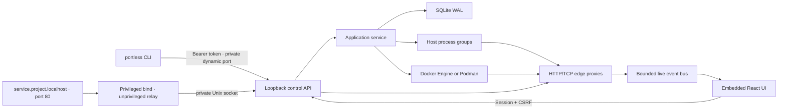

# Portless

Portless is a local application-environment control plane. One command discovers a checkout, starts its processes and container dependencies without fixed host ports, and opens a browser UI where you can inspect services, watch traffic, record a reproduction, and introduce scoped failures.

There is no required `portless.yaml`, Docker Compose project, account, or hosted control plane.

```text
cd billing
portless setup  # one time per machine
portless up

# Portless discovers and starts the environment, then opens the control plane at:
http://portless.localhost/projects/billing
```

Application ingress is stable and readable:

```text
http://checkout.billing.localhost
http://orders.billing.localhost
```

Processes, Postgres, and Valkey receive dynamically allocated loopback ports. Two checkouts can both have a service named `postgres`, both listen on their framework's usual port internally, and still run at once.

## What is implemented

- One lazily started, machine-local Go daemon and one native CLI executable.
- Static Spring Boot/Gradle and NestJS discovery with Postgres and Redis-compatible hints.
- Readable project and service names throughout the CLI, API, URLs, and UI; immutable ownership keys remain private.
- Process groups, dynamic ports, HTTP/TCP readiness, per-generation logs, dependency-aware start/stop, and durable operations.
- Direct Docker Engine or Podman networks, volumes, Postgres 17, and Valkey 8 with generated local credentials. Docker Compose is not used.
- Stable `.localhost` application ingress and per-edge HTTP/TCP proxies.
- Live bounded traffic summaries with default secret-header redaction.
- Named, bounded local recordings and JSON export.
- Named fault rules for latency, jitter, HTTP status, abort, probability, method/path scope, and automatic expiry.
- SQLite WAL state, project timeline, CLI bearer auth, one-use browser claims, session cookies, CSRF, Origin checks, and strict control/application Host separation.
- An embedded React/TypeScript control plane styled as a dense local operations console.

See [docs/implementation-status.md](docs/implementation-status.md) for the explicit boundary of this initial implementation.

## Build

Requirements for building Portless:

- Go 1.26 or newer.
- Node.js and npm for compiling the embedded UI.
- macOS or Linux.

Requirements for running discovered environments depend on the checkout. Docker Engine or Podman is needed only when Portless discovers managed container dependencies.

```bash
make
./bin/portless version
```

`make` is the complete build entry point. On a clean checkout it installs the
locked frontend development dependencies, compiles the embedded React UI, and
then compiles the Go executable. Later builds reuse `web/node_modules` until a
frontend manifest changes.

The Vite build is written to `webui/dist` and embedded by Go. The resulting `bin/portless` does not need Node.js to serve the UI.

## First run

1. Run `portless setup` once. It asks for administrator approval to install a minimal localhost-only port-80 relay, then immediately drops to your user account.
2. Install and start Docker Engine or Podman if the project needs Postgres or Redis-compatible storage.
3. Enter a Spring Boot or NestJS repository.
4. Run `portless up`.
5. Use the browser dashboard to inspect and control the running environment.

`portless project rescan` refreshes the discovered model while an environment is stopped. The next `portless up` uses the refreshed model immediately.

`portless setup` is idempotent. On macOS it installs a root-owned launchd job; on systemd Linux it installs an equivalent unit. The helper owns only `127.0.0.1:80`, drops privileges before accepting traffic, and cannot inspect or control projects independently of the user daemon. If another program already owns local port 80, setup stops with that conflict instead of replacing it.

Useful commands:

```text
portless status
portless open [service]
portless logs <service> --follow
portless traffic [service|source:target] --follow

portless runtime status
portless runtime use auto
portless runtime use docker
portless runtime use podman

portless record start checkout-debug --edge checkout:orders
portless record stop checkout-debug
portless record export checkout-debug

portless fault add slow-orders checkout:orders --latency 2000
portless fault add fail-payments checkout:payments --status 503
portless fault clear --all

portless down
portless down --volumes --yes
```

Ordinary `down` preserves managed volumes, history, logs, and recordings. Volume removal requires the separate destructive flag and confirmation.

## No mandatory project file

Portless starts with static discovery. It reads supported build manifests and example environment files; it never runs a Gradle task or package script during discovery. The discovered model is kept in the user-private SQLite database.

When a team wants a shareable declaration, this is additive rather than required:

```bash
portless project export
# writes portless.project.json
```

## Public naming model

Projects are identified by a machine-local DNS name such as `billing`. Services are identified by name within a project. Recordings and fault rules are named within a project. Operations and traffic use project-local integer sequences.

```text
GET  /api/v1/projects/billing
POST /api/v1/projects/billing/services/orders/restart
GET  /api/v1/projects/billing/recordings/checkout-debug/export
```

The API never asks a user for values such as `prj_01J...` or `svc_01J...`. SQLite and the selected container engine still use immutable private ownership keys so a rename cannot weaken cleanup safety.

## Architecture



The control API is served only for `localhost`, `127.0.0.1`, `::1`, and `portless.localhost`. An application Host is routed directly to ingress and receives `421` for `/api/...`, even on the same listener.

State defaults to `~/.portless`. Set `PORTLESS_HOME` to isolate development or test instances.

## Develop and test

```bash
make test
make

# Exercise discovery against the included small environment:
cd examples/golden-path
portless up --no-open
portless ui
```

Tests cover naming and non-leakage, discovery, SQLite idempotency, browser claims and CSRF, dependency ordering, process lifecycle, control/application host isolation, proxy traffic redaction, recording persistence, and fault application.

API reference: [api/openapi.yaml](api/openapi.yaml). Live event contract: [api/events.md](api/events.md).
