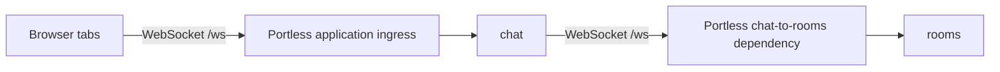

# Chat example: live WebSocket room

Status: implemented and validated on 2026-09-05.
Prepared on 2026-09-05 after selecting a live chat room with presence and
reconnection as the demo direction. Revised after a second contract and
lifecycle review on 2026-09-05.

Delivered under `examples/chat` with in-memory history. Validation passed:
25 Node tests on the minimum Node 22.12.0 version and on Linux Node 24.18.1;
all five Chromium journeys on macOS ARM64 and Ubuntu 24.04 ARM64; `make lint`;
`make test`; and whitespace checks. Desktop and mobile screenshots were
inspected in both themes. The isolated installations and Linux validation
container were cleaned up.

The normal `chat/local` environment is healthy and running at
[Chat](http://chat.local.chat.localhost). Joining through that public endpoint
was verified in the in-app browser. Store remains healthy with its original
service process IDs.

Build the **Chat** example under `examples/chat` as a small application that
makes WebSockets easy to see: open two tabs, choose two names, and have a
conversation. Messages, membership, and typing indicators update immediately.
Restart a service to watch both tabs reconnect. Use Chat as the example name in
its README, browser page title, example listings, and CI labels. Its default
project is `chat`.

## 1. User experience

The demo has one room, `lobby`, and one browser page.

1. Run the example with `portless up`, then open the `chat` service from the
   Portless control plane.
2. Enter a display name and join. No account or password is required.
3. Use **Open another tab**, join under a different name, and see both names
   in the member list.
4. Send messages in either tab. Both receive the same server-confirmed message
   with a name and timestamp.
5. Type without sending to see a typing indicator in the other tab. It clears
   after inactivity, sending, or leaving.
6. Restart `rooms` from Portless and see the connection state change to
   Reconnecting, then return to Connected without reloading either tab.
7. Leave explicitly to close the connection and stop automatic reconnection.

Each tab owns its name, draft, and connection independently. **Open another tab**
opens the same application URL with `noopener` and a fresh join form; it does
not copy an active identity. A full page reload also begins at the join form.
Names are fixed for a joined connection; changing one means leaving and joining
again. Duplicate names are allowed, with distinct member rows and a join-order
badge when needed. Membership and message attribution use server-assigned IDs,
never a display name as a unique key.

The page should feel like a small, finished chat application. The conversation
is the main area; a compact side panel contains the member list and the user's
name. Show connection status above the conversation and the composer below it.
Use a neutral charcoal, white, and gray palette, square controls, straight
dividers, and compact spacing. Keep the sidebar beside the conversation above
600 px; use a compact stacked layout on smaller screens while keeping the
composer visible. A collapsed “Try the demo” panel explains opening another
tab, restarting a service, and inspecting the handshake in Portless.

Use a responsive layout, light and dark theme variables, visible keyboard
focus, labeled controls, and restrained status colors. Enter sends; Shift+Enter
inserts a newline; IME composition must not accidentally send. Render message
text as text, preserving line breaks, rather than interpreting HTML or Markdown.
Announce connection changes accessibly without repeatedly reading the entire
transcript. Keep the user's scroll position when they are reading older messages.
Show a **New messages** control instead of forcing a scroll to the bottom.

The example README must explain these limits in ordinary language:

- Names identify demo participants; there are no authenticated accounts.
- The room keeps its latest 50 messages in memory. Restarting `rooms` clears
  that history.
- Portless Traffic captures the opening handshake. This demo displays the
  actual chat messages; Portless does not record or replay those messages.

## 2. Service topology and discovery

Use two Node.js services with Fastify and the `ws` library. Use the browser's
native WebSocket client and plain HTML, CSS, and JavaScript for the page.
No frontend bundler, database, container engine, or Portless declaration is needed.



| Service | Responsibility |
| --- | --- |
| `chat` | Serve the browser page and static assets, accept the browser socket, and connect it to `rooms` using the injected dependency URL. |
| `rooms` | Own membership, message validation, bounded room history, typing state, and broadcasts. |

Each browser connection has one corresponding `chat → rooms` WebSocket. This
deliberately exercises both forwarding paths and gives Portless visible
`external:chat` and `chat:rooms` opening exchanges. Room state belongs entirely
to `rooms`; `chat` forwards application messages without maintaining a second
copy of the room.

Both service manifests declare real Fastify dependencies and ordinary
`dev: node server.mjs` scripts. Each reads `PORT`, binds to loopback, and
registers a literal `/health` route. `apps/chat/.env.example` contains:

```dotenv
ROOMS_URL=http://rooms
```

The sample file is discovery evidence, not runtime configuration to load over
Portless's injected values. Fail startup with a clear message if `PORT` or
`ROOMS_URL` for `chat` is missing or invalid. Health routes describe the local
HTTP service and create no WebSocket connections or room members. An already
running `chat` should keep serving its page while `rooms` is unavailable, so
the browser can show and recover from that failure.

The existing Node detector discovers both services; the existing topology
analyzer discovers the HTTP dependency from that sample environment value.
`chat` sorts before `rooms` at their equal framework priority, so the current
primary-service selection chooses the browser app. Verify this through actual
discovery rather than changing discovery rules for the example.

The expected default address is:

```text
http://chat.local.chat.localhost
ws://chat.local.chat.localhost/ws
```

The browser derives its socket address from `location`, retaining the actual
host and port. `chat` derives its upstream socket from `ROOMS_URL`, converting
HTTP to WS or HTTPS to WSS while preserving the supplied host, port, and base
path and query. Append `/ws` to the base path; a leading slash passed to a URL
resolver must not silently discard that base path. Reject credentials,
fragments, and unsupported schemes in the dependency configuration. Keep normal
TLS verification and do not follow upstream redirects. It must not reconstruct
a public `rooms` address or dial a process port.
Private upstream addresses stay out of the browser UI and browser configuration.

## 3. Application protocol and connection handling

Use a single application subprotocol, `portless-chat.v1`, and small JSON text
messages. Protocol validation and room behavior belong to the example; Portless
continues forwarding opaque bytes with its existing implementation.

Require the subprotocol on both upgrades and verify the selected upstream
protocol before sending `ready`. Reject missing or incompatible offers before
acceptance; merely returning `false` from `ws`'s `handleProtocols` omits the
response header rather than rejecting the upgrade. Forward text explicitly as
text: `ws` can supply a Buffer for a text message, so forwarding that Buffer
must not accidentally turn the JSON into a binary message. Disable compression
for this small-message demo. See the [ws API](https://github.com/websockets/ws/blob/master/doc/ws.md).

| Direction | Message | Meaning |
| --- | --- | --- |
| `chat → browser` | `ready` | The upstream room connection is open; the browser may send `join`. No additional fields. |
| `browser → rooms` | `join` | `name`: enter the one supported room. |
| `rooms → browser` | `welcome` | `room: "lobby"`, `generation`, `self`, `members`, `typing`, and `history`: the initial authoritative snapshot. |
| `browser → rooms` | `message` | `requestId`, `text`: submit one message for confirmation. |
| `rooms → browsers` | `message` | `generation`, `id`, `sender`, `at`, `text`, `requestId`: the accepted message, including its confirmation. |
| `rooms → browsers` | `presence` | `generation`, `members`: replace the member snapshot after a join or departure. |
| `browser → rooms` | `typing` | `active`: set or clear this member's typing state. |
| `rooms → browsers` | `typing` | `generation`, `memberIds`: replace the active typing set without retaining event history. |
| Server → browser | `error` | `code`, `message`, optional `requestId`: a structured application failure. |

Every envelope has a string `type`. Members are `{id, name}` objects; `self`
and `sender` use that shape. `typing` in `welcome` is a list of member IDs, and
`history` contains the same accepted-message records used for live broadcasts.
Server-generated message IDs are consecutive positive integers within one room
generation; member IDs and generations are opaque strings, and timestamps are
server-generated ISO strings. Generate the room generation once per `rooms`
process, not whenever the room becomes empty. Clients cannot supply a sender,
timestamp, message ID, or membership ID.

`requestId` is a fresh UUID per submission, used only to correlate confirmation.
It is not a promise of idempotent or exactly-once delivery. Normalize and trim
names, reject blank names and control characters, and measure the name/text
limits in JavaScript UTF-16 code units to match the inputs' `maxlength`. Reject
whitespace-only messages while preserving meaningful text and line breaks.

The `ready` message avoids an unbounded queue while `chat` connects to `rooms`.
Accept the browser transport first, then create its one upstream connection.
Cancel that attempt if the browser leaves before it completes; late upstream
completion must close immediately. The browser sends `join` only after `ready`
and enables sending only after `welcome`. Early application messages, repeated
joins, unknown message types, malformed JSON, invalid names,
and oversized messages receive a defined rejection. Binary frames are outside
the chat protocol; the existing proxy tests already cover binary forwarding.

Make joining and acceptance synchronous room-state operations. Enqueue the
joining client's `welcome` before delivering later room broadcasts to it;
never await I/O between registering membership, taking the snapshot, and
enqueuing it. Append an accepted message to history before broadcasting it.
This keeps a concurrent join/send from losing a message between snapshot and
subscription. Broadcast failures remove only the failed member and do not stop
delivery to healthy members.

Implementation bounds:

- At most 32 pending or active client connections per example service. Reserve
  before asynchronous work; include unjoined connections and release on every
  failure path. Reject excess upgrades with HTTP 503.
- At most 8 KiB per client command, a 24-character display name, and 2,000
  characters of chat text. Mirror the text and encoded-command limits in the
  browser. Allow up to 512 KiB for server messages so a complete history snapshot
  can travel back through `chat`; configure each receiving side accordingly.
- Retain the latest 50 messages in `rooms` and 50 confirmed messages in the
  browser, plus at most one pending or unresolved submission. Ensure a full
  worst-case serialized snapshot fits the server-message limit.
- Bound each socket's pending output at 1 MiB and close slow connections
  instead of accumulating an unlimited send queue.
- Use a 5-second upstream handshake timeout and a 5-second join timeout starting
  when `rooms` accepts its connection. Clear both timers at their success point.
- Throttle browser typing updates to twice per second. Expire typing state
  after 3 seconds without an update.
- Each service pings its incoming clients every 15 seconds and terminates a
  connection that has not answered the previous ping. Thus `chat` checks the
  browser and `rooms` checks `chat`; browser JavaScript needs no ping API.

Both services handle socket errors explicitly and clean up timers, membership,
and paired connections exactly once. On service shutdown, stop admissions,
close clients with code 1001, and terminate remaining sockets after a 1-second
grace period. Close the HTTP server and clear all intervals as well; do not wait
for the library's much longer default close timeout.
An upstream failure closes its paired browser connection so the browser can
start a fresh attempt. Do not reconnect the upstream behind an existing browser
session or replay queued application messages.

| Failure | Wire behavior | Browser behavior |
| --- | --- | --- |
| Wrong path, Origin, or application subprotocol | Reject the HTTP upgrade with 404, 403, or 400 respectively. Do not dial the backend for a rejected `chat` request. | Show a generic connection failure if the browser exposes no more detail. |
| Invalid display name | `INVALID_NAME`, then close 1008. | Return to the join form for correction; do not retry automatically. |
| Invalid chat text | `INVALID_TEXT` with the request ID; keep the connection open. | Show the rejected submission and let the user correct it. |
| Malformed/early/unknown command or repeated join | `INVALID_COMMAND` when possible, then close 1008. | Stop retries and show a protocol error. |
| Binary or oversized message | Close 1003 or 1009. | Stop retries and show a bounded explanation. |
| Backend unavailable, a setup timeout, or a slow client | Best-effort `ROOM_UNAVAILABLE`, `JOIN_TIMEOUT`, or `SLOW_CLIENT`, then close 1013. | Retry with backoff while the user wants to stay joined. |
| Restart or unexpected transport loss | Close 1001 for planned shutdown; abnormal loss may have no close frame. | Reconnect and join again. |

Forward supported peer close codes through the pair. For abnormal upstream
loss, use 1011 on the browser side if a close frame can still be sent; never
pass the reserved observations 1005/1006/1015 to a close-frame writer. Use fixed,
short close reasons. [RFC 6455 closing rules](https://www.rfc-editor.org/rfc/rfc6455#section-7.4.1).

Check Origin on **both** public application endpoints. `chat` requires exactly
its page origin, derived from the validated Host including any test port; reject
missing, `null`, and foreign origins. Do not infer it from untrusted forwarded
headers. `rooms` rejects requests containing Origin: its intended non-browser
client is `chat`, which sends none. Otherwise the public `rooms` endpoint could
bypass `chat`'s browser check. This is a local demo boundary, not account
authentication.

Serve a restrictive application-owned CSP permitting local assets and the
explicit derived socket origin, rather than assuming `connect-src 'self'`
alone covers every browser's WebSocket handling. Serve only explicit static
asset paths. The upstream trace-header allowlist is `traceparent`, `tracestate`,
and `baggage`; do not forward Origin, cookies, or authorization. Keep raw
upstream addresses, submitted text, and drafts out of errors and service logs.

Use the library's frame parsing, masking, ping/pong, and close handling rather
than copying the fixture codec. References:
[ws examples](https://github.com/websockets/ws),
[ws API](https://github.com/websockets/ws/blob/master/doc/ws.md), and
[Fastify server API](https://fastify.dev/docs/latest/Reference/Server/).
Pin application and test dependencies in the example's own lockfile.

## 4. Reconnection and message delivery

Model connection state explicitly: Disconnected, Connecting, Joining,
Connected, and Reconnecting. After an unexpected loss, retry with bounded
exponential backoff, starting near 500 ms and capped at 5 seconds, with a small
amount of jitter. Reset backoff only after `welcome`, not merely an HTTP
upgrade. Allow only one socket attempt and one retry timer at a time. Tag each
attempt locally and ignore late events from superseded sockets. A 10-second
browser watchdog covers each opening, ready, and welcome stage so a half-open
attempt cannot leave the page stuck forever.

Known protocol/policy failures (close codes 1002, 1003, 1007, 1008, and 1009)
stop automatic retries and return to Disconnected with an actionable error.
An ordinary `INVALID_TEXT` response keeps the connection open. Transient
failures retry while the user wants to remain joined. Browsers cannot reliably
distinguish a refused HTTP handshake from other connection failures; do not
invent an exact HTTP status from the generic error event. Keep a visible Leave
button during retries, and show service-check guidance after 15 seconds without
joining. [Browser failure reporting](https://websockets.spec.whatwg.org/#feedback-from-the-protocol).

Keep the display name, draft, and any unconfirmed submission in memory in the
current tab. Clear online/typing indicators on disconnection. On reconnection,
repeat the join and replace the confirmed transcript with `welcome`'s latest
50-message snapshot; do not replay an unbounded catch-up stream. Match messages
by `(generation, id)`, and ignore events from an older socket attempt. Each
connection receives a fresh member identity. Retain history when the last
member leaves; only a `rooms` process restart resets the room generation and
history.

A generation change produces “Room restarted; history cleared.” If the client
previously received messages in the same generation and the oldest retained
message ID exceeds its last seen ID plus one, explain that some messages are
no longer available. Reconnection restores a recent snapshot, not guaranteed
delivery of every message sent during an outage.

Treat the editable composer and an outgoing submission as separate state:

1. On Send, save an immutable `{generation, memberId, requestId, text}` record
   and render it as pending. Clear the composer for the next draft.
2. Permit editing that next draft, but allow only one outstanding submission:
   Send remains disabled until the previous one is confirmed or resolved.
3. A matching server broadcast confirms the saved submission. It never clears
   or replaces text the user has typed since clicking Send.
4. An explicit rejection marks the saved submission rejected. A disconnect or
   5-second confirmation timeout marks it unconfirmed, not definitely unsent.
   After a timeout, close the attempt and reconnect to obtain a fresh snapshot.
5. On a same-generation rejoin, a history record matching the saved member ID
   and request ID can resolve an unconfirmed submission. Absence from bounded
   history cannot prove it was never delivered.
6. Retain unresolved text with Copy and Dismiss actions. Dismiss resolves that
   local pending state; Copy never overwrites the current draft. A manual resend
   is a new submission and can duplicate an earlier delivery. Never resend
   automatically.

Leave cancels retries and every watchdog, closes the current socket, clears
presence/typing, and preserves the current draft for another explicit Join.
Handle `pagehide` similarly for connection cleanup. On a persisted `pageshow`,
reconnect only if the user had still wanted to stay joined before navigation;
do not revive a session after explicit Leave. A fresh load always uses the join
form described in section 1.

| Action | Expected result |
| --- | --- |
| Close a tab or choose Leave | Its member and typing state disappear; Leave does not schedule another connection. |
| Restart `chat` | Tabs reconnect through its stable address; room history remains in `rooms`. |
| Restart `rooms` | Tabs reconnect and rejoin; the room begins with empty history. |
| Normally restart the Portless daemon | Both proxy connections close and reconnect; application PIDs and room history survive adoption. |
| Stop and start this environment | Tabs show Reconnecting and eventually rejoin; the restarted room has empty history. |

## 5. Files and repository integration

All application implementation belongs under `examples/chat`:

```text
examples/chat/
  README.md
  Makefile
  .gitignore
  package.json
  package-lock.json
  check.mjs
  test-support.mjs
  apps/
    chat/
      package.json
      .env.example
      server.mjs
      app.mjs
      app.test.mjs
      session.test.mjs
      public/
        index.html
        app.js
        session.js
        styles.css
    rooms/
      package.json
      server.mjs
      app.mjs
      room.mjs
      app.test.mjs
      room.test.mjs
  playwright.config.mjs
  e2e/
    installation.mjs
    fixtures.mjs
    chat.spec.mjs
```

Keep server construction separate from executable startup so network tests can
use ephemeral ports and deterministic teardown. `room.mjs` owns the room state;
do not introduce a general-purpose shared production package.
`public/session.js` owns this app's browser connection and delivery state so
late events and timers can be tested without coupling them to DOM rendering.
`public/app.js` owns the page. Serve `session.js` as an explicit asset.
The E2E installation helper owns startup, CLI calls, diagnostics, and cleanup;
the Playwright fixture gives each test a fresh installation instead of sharing
one global setup across lifecycle cases.

Add root Makefile wrappers following the existing example convention:

- `make example-chat-dependencies`: install locked example dependencies.
- `make test-example-chat`: syntax checks and the example's Node tests.
- `make test-e2e-chat`: build the isolated E2E binary and exercise the
  actual example in Chromium.

Keep Playwright as a dev dependency of the example, with its own configuration
and lockfile. `test-example-chat` checks the example's JavaScript syntax and
runs its Node tests; root `make lint` does not currently cover example JavaScript.
Use Node 22.12 as the minimum-version test and Node 24 for the main CI journey.
Ignore the example's npm cache, `node_modules`, test results, and HTML reports.

Document Node.js 22.12 or newer, npm, and an already configured Portless
installation as prerequisites. The startup walkthrough is dependency install,
`cd examples/chat`, then `portless up`. Include the source-checkout binary
alternative, the expected URL, opening another tab, service restart commands,
ordinary environment shutdown, and the history/inspection limits.
Include a separate, one-time browser installation command using the example's
Playwright package; do not require Chromium to run the application or silently
download a browser whenever its E2E target runs.

Link the example from `examples/README.md` and the root README's WebSockets
section. Extend `docs/e2e-testing.md` with the new target and its isolation and
artifact behavior. Add a dedicated example CI job using the existing pinned
actions, Go module version, Node 24, and matching Playwright Chromium. Run the
example tests and E2E target with bounded timeouts and retained failure logs.
Use the example lockfile for the npm cache key and install Chromium using that
package's Playwright version, rather than assuming the control UI's browser
revision matches. Give the Chat job a 20-minute limit and retain its command
log, daemon/service logs, trace, screenshot, video, and report on failure for
seven days.

Store and Dispatch remain separate examples. The existing fixture-based
WebSocket regression tests remain in place. This demo needs no daemon API,
proxy, CLI command, control-plane UI, or event-contract change.

## 6. Tests and acceptance criteria

Node tests should cover meaningful room and network behavior:

- Two clients join, receive the same ordered message, and see accurate presence.
- A newly joined client receives bounded history without duplicate delivery.
- Joining concurrently with a send yields one ordered snapshot/live stream.
  History and generation survive the last member leaving; duplicate names
  remain separate members.
- Typing expires and clears on send, departure, and connection failure.
- Malformed, oversized, early, and unsupported messages are rejected without
  corrupting the room or crashing either service.
- Limits, slow-client cleanup, pending upstream failure, and shutdown release
  connections and timers.
- Full-size history snapshots with multibyte and escaped text fit through both
  services. Text remains a text WebSocket message when forwarded from a Buffer.
- Both upgrade endpoints enforce the specified Origin/subprotocol rules; a
  rejected `chat` upgrade causes zero backend connection attempts.
- URL conversion preserves escaped base paths and queries; invalid settings
  fail clearly. Probe `/health` without creating an upstream socket.

Browser session tests should cover attempt watchdogs, capped retry backoff,
permanent rejection, stale events arriving after Leave or a newer attempt,
back/forward restoration, and typing a new draft before the previous send is
confirmed. Exercise rejection, confirmation timeout, recovery from a matching
history record, and an unresolved submission after history eviction or a room
restart. Use controlled clocks and peers at this layer; no message-delay switch
or other test-only endpoint belongs in the runnable app.

The dedicated Playwright suite must use a temporary `PORTLESS_HOME` and the
compiled E2E binary, with the real example services and real WebSockets. It
must not depend on or manipulate the developer's Store environment or installed
relay. Run teardown on success and failure; keep all state, logs, screenshots,
and reports in temporary or ignored locations.

Require an explicit `PORTLESS_E2E_BINARY` from the Make target and create the
test home before any CLI call. Never fall back to the normal installation or
run setup to repair a missing test binary. Run against the tracked example
checkout with only ignored dependency/output writes, as the other real-example
suites do. Construct the browser application URL by taking the private control
port from the test home and replacing only its hostname with the discovered
`chat` application host. Do not dial the app process port or rely on machine DNS.

Run one worker with bounded CLI calls and no retries that could hide failures.
Each lifecycle scenario starts with a fresh isolated installation so room
history and service restarts cannot bleed between tests. Cleanup must also work
after partial startup. Capture diagnostics before removing the test home, stop
only its verified installation, and fail the test if owned processes remain.
Do not collect install keys or token-bearing state files as CI artifacts.

The browser suite proves:

1. Discovery produces exactly `chat`, `rooms`, and the `chat:rooms` HTTP edge
   without a Portless configuration file; `chat` is the primary service.
2. Two independent browser contexts join with different names, exchange
   messages, see typing, and observe one another leaving. Also exercise the
   actual **Open another tab** control to verify a fresh, independent join form.
3. Both `external:chat` and `chat:rooms` HTTP 101 exchanges are inspectable
   through the normal CLI while sockets remain open. Chat content is absent
   from Portless capture.
4. Restarting `rooms` reconnects both clients, clears room history, removes stale
   presence, and permits new messages without a page reload.
5. Normal daemon replacement preserves application PIDs and room history;
   clients reconnect and send again without duplicate messages.
6. Restarting only `chat` preserves room history; stopping and starting the
   isolated environment clears it and reconnects the still-open tabs.
7. Explicit Leave cancels retries, including during an attempted connection.
   Messages cannot be submitted offline. Stop only the isolated `rooms` service
   long enough to observe the unavailable state, then start it and recover.
8. The page works by keyboard and at desktop/mobile widths in both themes.
   Check long/duplicate names, multiline and HTML-looking text, new-message
   scrolling, empty state, and connection errors. Inspect screenshots at
   390 px, 700 px, and 1280 px widths; check a full join/send/leave sequence by keyboard.

All browser journey networking remains real: no WebSocket interception or
request stubs. Use edge/status filters and an exchange sequence watermark for
traffic assertions, rather than exact global counts that include health checks.
The deterministic session tests above prove ambiguous-delivery behavior without
making the product browser journey depend on a race or message-level fault hook.

Use condition-based waits and bounded deadlines. Validate timing behavior with
controlled clocks where possible rather than long fixed sleeps. Existing proxy
tests retain responsibility for protocol-level binary, fragmented, compressed,
and control-frame forwarding; the chat demo does not recreate that matrix.

## 7. Implementation order and completion gate

1. **Scaffold and discovery:** create the npm workspace, locked dependencies,
   service manifests, health routes, and sample dependency setting. Prove
   discovery and startup in an isolated installation.
2. **Room behavior:** implement membership, bounded history, message validation,
   typing, and deterministic cleanup with focused Node tests.
3. **Browser connection path:** implement `chat`'s paired upstream connections,
   the ready/join protocol, Origin/CSP handling, and failure cleanup.
4. **Chat interface:** build the two-tab experience, delivery confirmation,
   reconnection states, responsive layout, and keyboard behavior, including
   deterministic tests for the browser session owner.
5. **Compiled-product proof:** add the dedicated browser suite and test service
   and daemon restarts through Portless.
6. **Integration and handoff:** finish README links, Makefile targets, CI,
   visual inspection, and the complete validation below.

Before handing off an implementation, run:

```bash
make test-example-chat
make lint
make test
make test-e2e-chat
git diff --check
```

Run the new browser journey on macOS and Linux and report the actual
environments tested. Also run the example's Node tests on its documented minimum
Node version. Machine-destructive relay tests and resource-container suites are
not needed for this example.

After implementation and validation, start only the new `chat/local`
environment for the local demo and provide its application URL. The demo's
assets are served by `chat`; they do not require rebuilding the embedded
Portless control UI or routinely restarting the developer's daemon.
Use an executable containing the implemented WebSocket feature. Verify the new
environment is healthy and leave it running for review. If `chat/local` already
exists and its source does not match this example, report that conflict rather
than replacing it. All restart/down tests belong to temporary installations;
starting this demo must leave the user's existing Store environment intact.

The demo is complete when a developer can follow the README, open two tabs,
see real messages/presence/typing, restart a service and recover, and inspect
both Portless handshake paths without adding configuration or changing Store.

Out of scope for this first version: multiple rooms, durable storage, accounts,
uploads, binary attachments, rich text, read receipts, hosted deployment,
WebSocket frame inspection in Portless, and changes to the forwarding feature.
