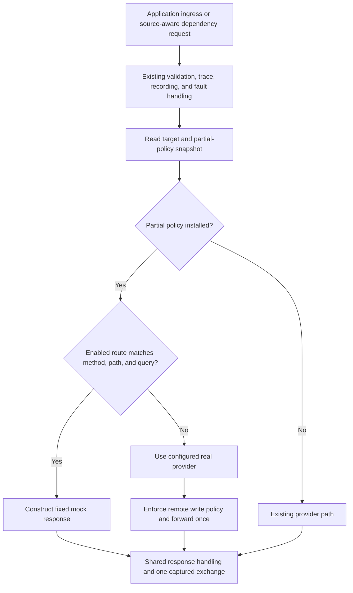

# Partial HTTP mocks

Status: implemented with an editable full/partial dropdown and tracked provider handoffs, 2026-09-07.
Full/partial type can be switched in the scenario editor. The Mock type setting
describes unmatched-request behavior, and the route list contains only saved
routes.

Validation passed: focused Go and architecture checks, `make lint`, `make test`
(477 web tests plus all Go tests and the site checks), and both partial-mock
browser journeys. Those journeys cover enabled and disabled mode changes,
real forwarding versus 501 responses, route/draft preservation, and reloads.
Both themes were visually checked. The complete executable and tracked web
assets were rebuilt; the normal daemon restart completed in 1,676 ms and
preserved all eight running service identities across `chat/local` and
`store/local`. The running daemon reports API 20.1.0 and serves the matching
built bundle. Machine-destructive relay suites were not run.

## Outcome

A developer can override selected HTTP requests while the target service keeps
running. For example, a scenario can return a fixed response for
`GET /inventory/{sku}` while `/health`, other inventory URLs, and unrelated
methods continue to the service's configured provider. Enabling or disabling
partial mocks preserves the service process, debugger, public endpoints, and
source-to-target dependency connections.

Keep the existing strict behavior available and make it the creation default.
Forwarding is an explicit scenario setting. This plan covers the complete
daemon, persistence, API, CLI, MCP, browser, preview, traffic, and recovery change.

## Decisions for the first release

| Decision | Contract |
| --- | --- |
| Configuration | One `unmatchedRequests` policy per scenario: `reject` or `forward`. |
| Default | `reject`, displayed as **Full mock**; unmatched requests return 501. |
| Partial mode | `forward`, displayed as **Partial mock**; unmatched requests forward to the service. |
| Scope | All services targeted by that scenario use its policy. |
| Provider support | Existing HTTP application services backed by local processes or classified remote HTTP(S) providers. Managed database/broker resources remain ineligible. |
| Coverage | The target set continues to include services from disabled routes. |
| Ownership | At most one enabled scenario per service, across both policies. No scenario stacking or priority rules. |
| Editing policy | Switch full/partial mode through a durable operation; preserve routes and enabled state and attempt rollback on failure. |
| Editing routes | Preserve existing live response edits, route renames, and route toggles. Changes to the target service set still require disabling first. |
| Unavailable upstream | An unmatched forwarded request returns the normal unavailable/upstream error. It does not start a process or change providers. |
| Matched failure | A matched 4xx/5xx, delay, cancellation, or response-writing failure never triggers forwarding. |
| Preview | Predict the routing decision without contacting an application. |

The policy applies to ordinary HTTP requests. In forward mode, valid WebSocket
upgrades continue through the existing WebSocket forwarding path and bypass
ordinary HTTP mock matching. Strict mode retains its existing upgrade rejection.
WebSocket handshake/message mocks, TCP/gRPC mocks, request-body matching,
scripted responses, and per-service policy overrides are outside this release.

## Starting implementation and affected ownership

The current behavior is deliberate and spans more than the unmatched response:

- [The mock ADR](../architecture/decisions/0007-deterministic-http-mock-provider.md)
  describes strict replacement, private listeners, exact provider restoration,
  and service ownership.
- [Scenario activation](../../portless-daemon/controlplane/mock_scenario_activation.go)
  saves previous bindings and changes each target to `ProviderMock`.
- [Provider handoff](../../portless-daemon/controlplane/provider_change.go)
  stops the selected local service. Adding fallback inside the mock listener
  alone would leave no local service to receive it.
- [Mock responses](../../portless-daemon/mocks/response.go) and preview share the
  current unmatched 501 response; [the matcher](../../portless-daemon/mocks/matcher.go)
  already owns bounded compilation and deterministic method/path/query matching.
- [The proxy](../../portless-daemon/traffic/proxy/manager.go) owns source identity,
  remote policy, trace context, faults, HTTP transport, and capture. Ordinary
  ingress, dependency requests, and replay converge here.
- [Activation hydration](../../portless-daemon/database/mocks.go) currently
  counts a service as active only when its binding is `mock`. Partial activation
  must therefore update inspection as well as request routing.
- [Replay preparation](../../portless-daemon/controlplane/replay.go) currently
  resolves destination policy from a service binding and a private target
  generation. A partial mock introduces a request-specific destination decision.

| Owner | Work |
| --- | --- |
| `portless-daemon/mocks` | Compile once; decide match/no-match; construct fixed responses shared by strict runtime, partial runtime, and preview. |
| `portless-daemon/traffic/proxy` | Publish partial routing policies, select real or mock execution, preserve HTTP/WS semantics, enforce forwarding policy, and capture the actual outcome. |
| `portless-daemon/controlplane` | Validate policy and service ownership; coordinate activation, route updates, start/stop/recovery, inspection, and replay resolution. |
| `portless-daemon/database` | Persist scenario policy and activation ownership, validate versions, clone configuration, and recover desired state. |
| `portless-daemon/api/contract`, `client`, `server` | Own the wire changes, typed calls, and injected adapters. |
| `portless-cli/mocks` | Creation/configuration commands, concise inspection, preview output, completion, and JSON. |
| `portless-mcp` | Configuration and inspection parity through the typed client and existing capability gates. |
| `portless-web/src/features/mocks` | Scenario creation, route editing, mode presentation, and preview outcomes. |
| Web environment/traffic features | Accurate service badges, provider details, and exchange attribution. |

Keep these existing package boundaries. The proxy already imports the mock
package; the mock matcher must not import the proxy, control plane, API server,
or CLI. No new top-level package, executable, privileged listener, or relay
change is required.

## Runtime design

### Preserve the configured provider in forward mode

Strict mode continues to use its service replacement and restoration lifecycle.
Forward mode retains the original `ComponentBinding` and service runtime, and
attaches a compiled scenario policy to the logical environment/service target.
Do not label the retained local/remote binding as `ProviderMock`, embed another
provider inside `MockTarget`, or store the public hostname as a fallback URL.

Add a narrowly scoped partial-policy registry under `traffic/proxy`. It holds
immutable compiled scenario references, the owning scenario, and a private
routing revision. It is separate from the real target's process/address
lifetime, so replacing a process target does not accidentally discard its mock
configuration. Reading a request's target and policy produces one consistent
snapshot under the manager's existing synchronization.

Compile once per scenario revision, outside the proxy lock. Publish references
atomically for every affected forward-mode target. Requests already admitted
keep their selected snapshot; later requests use the replacement. Do not hold
the registry lock while delaying, forwarding, or streaming a response. Retain
only the selected response/destination and attribution after matching; a long
forwarded stream must not retain every route in an obsolete scenario revision.

Keep provider generations separate from mock routing revisions. A route edit
must invalidate a prepared replay without closing an unrelated WebSocket or
restarting a local process. Environment removal and daemon shutdown clean up
both registries; ordinary target replacement retains the desired mock policy.

### Request flow



1. Preserve the original logical source and target through either branch.
   Include external application ingress as well as dependency requests.
2. Select fallback from the daemon's registered real target. Never make a new
   request to the public Portless URL, recursively re-enter `forwardHTTP`, or
   follow an HTTP redirect as a fallback mechanism.
3. Evaluate the matcher before opening an upstream connection. Forward only
   on a typed no-match result. Do not interpret HTTP 404/501, response headers,
   an error body, or an exception as evidence that a route did not match.
4. Reuse the existing matcher rules: exact methods, service isolation, exact
   and template paths, repeated query values, regex bounds, specificity, and
   ambiguity rejection. HEAD retains its current explicit-method matching;
   there is no new implicit GET fallback.
5. Keep response construction in `mocks`. The partial branch should supply a
   fixed response to the shared proxy response/capture path, with typed
   scenario/route attribution. It needs no extra local mock listener.
6. Preserve HEAD/204/304 suppression, headers, configured delay, cancellation,
   response bounds, and structured strict no-match errors. Continue using
   the same construction semantics for the strict private runtime.
7. Forward the original method, escaped path, query, headers, and streaming
   body through the existing transport. Preserve remote base-path joining,
   Host rewriting, TLS verification, hop-header handling, and trace injection.
   Matching must not consume or duplicate the body.
8. Keep the existing fault ordering. A fault that ends a request prevents both
   the mock response and forwarding; it must not be labeled as a forwarded
   mock miss. Capture, recording limits, counters, and trace attribution run
   once for each request, including a forwarded request.
9. Apply remote read-only enforcement before an unmatched request leaves the
   machine. A matched POST mock can return locally even when the retained
   remote binding is read-only; an unmatched POST is blocked locally. Mock
   responses never loosen the real provider's saved policy.
10. A missing/corrupt policy for a service known to be under partial control is
    a recovery error, not permission to forward everything. Keep an ownership
    guard until reconstruction succeeds and return a structured unavailable
    response for requests that cannot be evaluated safely.

### Health, process lifecycle, and WebSockets

- Successful enable/disable in forward mode changes no process PID, process
  generation, debugger session, binding, or existing proxy listener address.
- For an active environment, activation requires a configured supported real
  target already available in the runtime. It does not implicitly start a
  stopped service or perform an extra application request as a preflight.
- For a stopped environment, activation saves desired configuration. Normal
  `up` starts the real provider and installs its mock policy before admitting
  traffic to the target.
- If the real provider fails unexpectedly after activation, retain admission
  for the saved partial policy. Matched requests still receive their fixed
  response; unmatched requests fail through the ordinary unavailable path.
  Report the actual service health, never an unconditional healthy state merely
  because some URLs are mocked.
- An explicit service/environment stop closes admission according to the
  existing lifecycle contract. A partial policy must not keep a deliberately
  stopped service serving responses. Its desired configuration remains saved
  for the next start. Restarting that service restores its partial policy.
- Real provider readiness checks continue to test the real provider, bypassing
  request overrides. A mocked `/health` must not conceal a failed runtime.
- Forward-mode WebSocket upgrades retain current validation, remote write
  policy, limits, capture, and session cleanup. Ordinary HTTP mock route edits
  and scenario toggles do not terminate established WebSockets. Strict-mode
  replacement retains its current session behavior.

## Persistence, ownership, and activation

### Stored configuration

1. Add a validated policy type to the domain and expose it through the wire
   contract. Responses always return an explicit `unmatchedRequests` value.
2. Add `unmatched_requests TEXT NOT NULL DEFAULT 'reject'` to `mock_scenarios`
   with validation for the two values. Use schema migration 12 if 11 remains
   the latest version at implementation time. Existing rows become explicit
   strict scenarios; no scenario changes its runtime behavior during upgrade.
3. Update all inserts, reads, metadata-only queries, scenario versions, clone
   SQL, and import paths. Imports preserve the destination scenario's policy.
4. Extend the existing private activation records to identify the policy used
   for that activation. Preserve the unique environment/service ownership
   constraint across both modes. Keep the exact baseline binding private.
   In strict mode it is restored; in forward mode it is checked for unexpected
   drift and is never reapplied merely to disable the scenario.
5. Validate the policy at creation and reject invalid explicit values. Return
   resource versions for inspection and existing conditional resource mutations.
6. The full/partial type never changes after creation. Route edits, imports,
   activation, and cloning preserve the selected default behavior.

### Policy-aware activation projection

The existing `hydrateMockActivation` assumes `binding.provider == mock`.
Replace that assumption consistently in full scenario reads, metadata-only
reads, list responses, events, CLI/MCP results, and the browser:

- Strict: ownership records and the saved mock binding identify active targets.
- Forward: ownership records, retained baseline bindings, and applied policy
  snapshots identify active targets.
- Stopped environment: a complete valid desired configuration may be enabled
  without a live process or listener, matching the existing configuration
  meaning of activation.
- Running environment: an incomplete or failed policy reconstruction is
  degraded. Do not confuse real upstream health with scenario activation.

Centralize the final projection in the control plane where runtime policy
state is available. Database queries supply bounded durable facts; they must
not query the proxy. Keep full and metadata-only views consistent without
loading response bodies for metadata inspection. Update the GoDoc/OpenAPI
meaning of `activeServices` from services bound to a mock provider to services
controlled by the scenario's selected policy.

Expose optional `service.mock` context in environment/service inspection with
`scenario`, `unmatchedRequests`, and `state`. Populate it for controlled services
in either mode, including degraded ownership. This describes an intervention
separately from the provider binding and supports the browser and MCP without
exposing restoration records, private addresses, or ownership keys.

### Forward activation sequence

Use the existing project mutation lock, tracked operation, timeout, actor, and
idempotency machinery:

1. Reload the named scenario and environment; reject pending lifecycle changes,
   degraded activation, invalid policy, empty scenarios, or overlapping owners.
2. Validate the complete target set and baseline providers. Compile the whole
   scenario before publishing any routing change.
3. Persist complete desired ownership and baseline configuration transactionally.
4. Publish the prepared policy snapshots for the covered services atomically
   within the proxy registry. No provider handoff is performed.
5. Publish `mock.state` and the updated environment/service projection, append
   the existing activation timeline event with policy metadata, and complete
   the operation only after the runtime projection is consistent.
6. On failure, restore the previous policy snapshot and durable ownership.
   If restoration cannot finish, retain ownership, report degraded state and
   the failed operation, and keep affected routing guarded for reconciliation.

Disable forward mode by withdrawing its policies and releasing its ownership
records, with equivalent rollback behavior. Leave the current real provider
alone. Disable All continues its existing sequential operation/error model,
choosing strict restoration or partial-policy withdrawal for each scenario.
Update progress messages so they describe the actual work.

Route edits compile and validate the complete candidate first. Commit the edit
and atomically replace the active compiled snapshot; a persistence or publish
failure must retain the last working version or explicitly guard recovery.
Do not forward requests through a gap between removing and installing matchers.

## Recovery and environment operations

Audit [execution](../../portless-daemon/controlplane/execution.go),
[reconciliation](../../portless-daemon/controlplane/reconcile.go),
[execution graphs](../../portless-daemon/controlplane/graph.go), and
[service operations](../../portless-daemon/controlplane/operations.go).

- Load desired scenario ownership and compile partial policies before opening
  recovered targets to traffic. Restore the real target and policy as one
  admitted view, rather than briefly exposing the unmodified real service.
- Keep the real provider in dependency ordering and local process adoption.
  Its outgoing dependency proxies must still be restored; a partially mocked
  caller may make real downstream calls on forwarded endpoints.
- Rebuild partial policies after normal daemon restart, hard crash recovery,
  environment start, and service restart. Preserve verified process adoption
  and the existing five-second normal daemon restart deadline.
- Handle crashes after durable reservation, after policy publication, and
  during disable using desired state and existing operation recovery. Never
  infer successful activation solely from an unchanged local binding.
- Clone policy, routes, desired activation, and private baseline records into
  the new environment independently. Runtime pointers, listener addresses,
  process ownership, and routing revisions are never copied.
- Preserve the current requirement to disable a scenario before directly
  changing a covered service's provider or removing its source/topology.
- Stop/forget/reset/uninstall clear the appropriate runtime registries and
  durable state through their existing authorized lifecycle paths. Testing
  these paths uses isolated Portless homes.

## HTTP and event contracts

Implement contract types first, then typed client, server adapters, and consumers.
API `20.1.0` adds the durable scenario policy operation to the preview union,
partial activation semantics, creation policy, and inspection fields.

### Scenario configuration

Add `unmatchedRequests` to `MockScenario`, `MockScenarioMetadata`, and
`CreateMockRequest`. Omission on creation means `reject`; explicit unknown,
empty, or null values are validation failures. Use a presence-aware input type
so omission and an invalid explicit value are distinguishable.

Change the scenario type with `PUT /mocks/{scenarioName}/policy`, requiring
`unmatchedRequests` and returning a tracked operation. The typed client, CLI
configure command, browser switch, and MCP policy tool share this operation.
An enabled scenario is disabled, updated, and re-enabled under one environment
lock. Failure attempts to restore the original mode and enabled state. Routes
and scenario identity remain intact. Degraded scenarios require disabling first.
MCP policy changes require traffic control plus lifecycle capabilities.

### Preview outcomes

Replace `matched` plus an always-required status with one discriminated
`MockPreview` result. Keep request/draft/originalRoute input semantics.

| `outcome` | Required result | UI |
| --- | --- | --- |
| `mocked` | Service, matched route, and fixed response `{status, headers, body, delayMs}` | Expected mock response. |
| `rejected` | Service and the existing structured 501 response | No route matched; unmatched requests are rejected. |
| `forward` | Service and safe destination metadata | Would forward to service. No predicted status/body. |
| `blocked` | Service and structured reason | Forwarding would be blocked by configured policy or invalid destination configuration. |

For example:

```json
{
  "service": "inventory",
  "outcome": "forward",
  "destination": {
    "provider": "local",
    "url": "http://inventory.local.store.localhost"
  }
}
```

- Resolve against the saved policy and candidate routes (including the one
  permitted unsaved draft). Validate that the preview service is covered by
  that candidate; an unrelated service is a structured input error.
- Use only configured/safe destination information. Public service identity,
  public endpoint, provider kind, and remote classification/write policy are
  sufficient. Never return the private listener or secret-bearing binding.
- Report a known remote read-only denial as `blocked`. Do not probe upstream
  health or claim that the future forwarded response will succeed. A stopped
  environment can still preview the configured routing decision.
- Valid WebSocket preview inputs in forward mode report forwarding without
  opening a session; strict mode reports its existing unsupported behavior.
- Keep no side effects: no application request, health check, process start,
  persistence, fault match-count increment, traffic, recording, or timeline.
- Mark results outdated when relevant provider configuration, saved routes,
  route drafts, or sample requests change. Preserve existing
  cancellation and late-result protection.

### Events and versions

- Extend `mock.state` with the policy and the same activation projection used
  by inspection. Policy changes emit `mock.updated` and `mock.state`; clients
  follow the tracked operation to completion and refresh the scenario.
- Update environment/service events with safe mock context, and retain
  `operation.state` for activation progress.
- Update OpenAPI schemas/examples, event documentation, wire fixtures, and all
  preview consumers together. Keep one current wire format.
- Daemon lifecycle protocol `4.0.0` and supervisor protocol `2.0.0` should stay
  unchanged if their serialized contracts stay unchanged. If implementation
  changes handoff receipts or their compatibility semantics, make that version
  change explicit. Do not change a supervisor protocol for UI metadata alone.

## Traffic, recordings, and replay

### Exchange attribution

Add optional `mockOutcome` metadata with values `mocked`, `forwarded`,
`rejected`, or `blocked` for requests evaluated under a scenario. Preserve
`mockScenario` as the evaluated scenario and `mockRoute` only for an actual
route match. Update their documented meanings coherently.

| Actual result | `targetProvider` | Scenario/route attribution |
| --- | --- | --- |
| Fixed mock response | `mock` | Scenario + route + `mocked`. |
| Strict no-match 501 | `mock` | Scenario + `rejected`; no route. |
| Forwarded response or upstream failure | Actual `local`/`remote` provider | Scenario + `forwarded`; no route. |
| Locally blocked remote forwarding | Intended `remote` provider | Scenario + `blocked`; no route. |
| Terminal fault before mock evaluation | Existing fault attribution | No invented mock outcome. |

Forwarded outcomes retain the real provider's remote classification. Read
attribution from internal routing decisions, never from untrusted upstream
headers. Strip private mock attribution headers using the existing strict
runtime boundary; a real service cannot claim a mock route by returning them.

Carry metadata through live exchange summaries, detail, trace interventions,
recording storage/export, replay results, and MCP projections. Update browser
badges/tooltips to distinguish **Mocked** from **Forwarded**; forwarded exchanges
must not inflate counts of mock-served responses. Preserve one exchange with
the original logical caller, including requests made by a partially mocked
service to its own dependencies.

Update the recording export schema from 4 to 5 with this contract, including
both ordinary and chunked exporters and their docs/tests. Preserve real
recorded request/response data and redaction. Existing retained events can
omit the new optional outcome; do not invent historical routing decisions.
Recording/OpenAPI import keeps its existing selection behavior and does not
change the destination scenario policy.

### Replay must resolve the request-specific destination

Partial matching must participate in replay preparation and admission, not
only in the final HTTP handler:

1. Extend the internal replay resolver to accept the validated draft's
   method/request target and select the same immutable mock/real decision as
   ordinary traffic. It remains free of application I/O.
2. Include both real-target generation and mock routing revision/policy in the
   private prepared destination identity. Display safe scenario/route context
   for a mocked destination and the real provider/policy for forwarding.
3. Apply existing remote-write confirmation and read-only checks to requests
   that will actually be forwarded. A local matched mock response needs no
   remote-write confirmation, even when its base provider is remote.
4. Revalidate the reviewed decision before dispatch. Scenario enable/disable,
   route changes/renames, or provider changes invalidate stale
   preparation; return the existing stale-destination workflow and prepare
   again. Never turn a reviewed mock response into an unreviewed remote write.
5. Once admitted, use the captured decision for that run and preserve existing
   timeout, idempotency, payload limits, outcome receipts, and single-dispatch
   behavior. A synthetic mock response is recorded as response-received.
6. Keep this routing revision distinct from the provider generation used for
   long-lived WebSocket and process ownership. Policy edits must not cause
   unrelated session teardown as a side effect of invalidating replay drafts.

## Browser, CLI, and MCP workflow

### Browser

- Add **Mock type** to creation: **Full mock** (default, reject) or **Partial
  mock** (forward). Allow changing it later in the scenario editor.
- Make the scenario name the main editor title, with a Mocks back link above it.
  Place the activation switch on the right, with joined **Full mock** and
  **Partial mock** buttons below it. Keep both choices visible, highlight the
  current type, and show unmatched-request help on hover. Apply
  immediately, show pending state, block conflicting edits, preserve route drafts,
  and refresh the mode description and previews after completion. List only
  saved routes in the route browser; show unmatched-request behavior with the
  Mock type setting. Keep selected-route identity and Edit/Preview tabs in a
  shared toolbar directly above the route list and editor.
- Show **Partial** or **Full** beside the scenario name. Keep Scenario A–Z as
  the table default and preserve row order through lifecycle changes.
- Use the safe service mock context for topology, Overview, and the service
  drawer. A partially mocked service still displays its real provider, real
  process/debug controls, actual health, and visible/copyable public endpoint.
  Label its intervention **PARTIAL MOCK** and link to the scenario.
- Update preview response rendering for all four outcomes. Forward/blocked
  results have no fabricated response body, status, or empty response tabs.
- Preserve both themes, keyboard focus, focus mode, narrow layouts, and
  existing route-draft retention. Keep the fixed default behavior through route edits.

### CLI

Use the current `portless-cli/mocks` ownership and typed daemon client:

```bash
portless mock create inventory-test --unmatched-requests forward
portless mock show inventory-test
portless mock preview inventory-test --service inventory --path /health
```

- Add the validated flag to create; complete `reject`/`forward` and scenario
  names. The type cannot be reconfigured after creation.
- Show unmatched-request behavior in human list/show output and JSON. Preview
  prints a fixed response, rejection, forwarding destination, or policy block
  according to the result; `--json` exposes the complete discriminated result.
- Enable/disable still wait for the tracked operation. Explain removal of
  partial overrides accurately instead of claiming that providers restarted.
- Update command-tree tests, help/completion fixtures, and
  `portless-cli/COMMANDS.md`.

### MCP

- Add the policy to scenario creation, metadata results, and inspection.
- Expose `portless_set_mock_scenario_policy` with traffic control plus lifecycle
  capabilities, durable receipts, retry keys, and bounded waits.
- Update activation/Disable All descriptions to cover both provider
  restoration and partial-policy withdrawal. Preserve actor attribution,
  idempotency, bounded waits, and metadata-only mutation results.
- Map every preview outcome; respect `includePayloads` and sensitive-traffic
  settings. Forward metadata never reveals private/secret-bearing endpoints.
- Update the tool inventory, permission matrix, configuration docs, and
  capability-count fixtures affected by the policy tool. Do not expand default
  capabilities or route around the API client's transport boundary.

## Implementation sequence and completion gates

These are ordered work slices of one feature. Do not ship a version with only
some API consumers updated.

| Slice | Implementation | Completion gate |
| --- | --- | --- |
| 1. Contract | Policy enum, creation policy and client types, preview union, safe service context, traffic outcome, version changes, and OpenAPI/event draft. | Contract/client fixtures define one coherent API 20.1 format. |
| 2. Storage | Schema migration, creation/update/metadata/clone paths, version preconditions, mode-aware ownership facts. | Strict data keeps its behavior; invalid policies fail and mode changes preserve scenario identity and routes. |
| 3. Runtime | Shared response decision, partial registry, immutable snapshots, forwarding and read-only enforcement, capture, WS interaction. | Matched requests never reach upstream; misses forward once with complete body and original edge identity. |
| 4. Lifecycle | Forward enable/disable, state projection, live edits, rollback, recovery, start/stop/clone and provider guards. | Same PIDs/debuggers/listeners before and after partial toggles; no recovery interval silently bypasses mocks. |
| 5. Replay/observability | Request-specific preparation, revision invalidation, actual destination policy, traffic/recording/MCP projections. | A previously reviewed mock cannot become an unreviewed forwarded request; attribution is correct and counted once. |
| 6. User surfaces | CLI, MCP, creation and route editing UI, preview, scenario/service/traffic labels, accessibility. | The feature is configurable and inspectable end to end through every supported consumer. |
| 7. Validation/docs | Focused tests, complete non-destructive validation, E2E, regenerated assets, documentation, normal daemon restart. | All acceptance criteria below pass and the running UI serves the built checkout. |

## Validation plan

### Owning-layer tests

| Layer | Required cases |
| --- | --- |
| Matcher/response | Exact/template/query/regex selection; disabled routes; service isolation; explicit HEAD behavior; 204/304; fixed 501 as a valid matched response; typed no-match; delay cancellation. |
| Proxy | Match produces zero upstream hits; miss forwards exactly once; repeated/escaped queries and streamed request bodies; remote base path/TLS/Host handling; unavailable base; terminal faults; headers cannot spoof attribution; one capture/recording; no public-host recursion. |
| Policy | Read-only remote matched POST responds locally; unmatched POST is blocked with zero upstream hits; safe methods and read-write policy forward normally. |
| Concurrency | Continuous traffic during route edits/toggles sees complete old/new decisions; no empty matcher window; registry locks do not span I/O; run relevant proxy/control-plane tests with `-race`. |
| Persistence | Default/explicit policy, schema upgrade to reject, metadata parity without body loads, stale If-Match, ownership conflict across modes, clone independence, imports retaining policy, transaction rollback. |
| Activation | Multi-service partial enable/disable without PID/generation/debug/listener change; mixed strict/partial Disable All; active-mode edit rejection; all-routes-disabled forwarding; provider-change/coverage guards. |
| Recovery | Crashes at each persistence/publication boundary, normal restart with live caller dependencies, service crash/restart, explicit stop/start, corrupt or missing policy guard, stopped-environment activation. |
| Preview | Four outcomes, invalid/uncovered service, unsaved draft and rename, disabled scenario, provider-policy changes, zero network/process/persistence/traffic side effects. |
| Replay | Match/miss preparation, remote policy and confirmation, invalidation after every route/policy/provider mutation, immutable admitted decision, outcome receipt, no duplicate request. |
| WebSockets | Existing session survives partial toggle/edit; new upgrades forward with preserved caller identity and remote policy; strict rejection remains; no mock frames. |
| API/CLI/MCP | Typed serialization, errors and preconditions, actor/capability checks, metadata/payload redaction, human/JSON/preview output, completion/help, updated tool inventory. |
| Vitest | Strict default, creation, editable type, pending controls, permanent default row, name order, all preview results, stale previews, actual provider plus partial badge, distinct traffic outcomes. |

### Real product journeys

Add focused CLI and browser journeys using the compiled E2E binary and temporary
Portless homes, following [the E2E guide](../e2e-testing.md):

1. Use `store-lite`: partially mock one inventory endpoint; show another
   inventory endpoint still responds from the original service. Check real
   process IDs, generations, clean endpoint names, and the checkout-to-inventory
   edge before/after enable and disable.
2. Partially mock a caller service while a forwarded endpoint calls its real
   dependencies. Verify dependency proxies, parent/child trace correlation,
   and record/export attribution after a normal daemon restart.
3. Disable the only enabled mock route and show that its request now forwards
   while scenario ownership and the other service's behavior remain stable.
4. Compare strict and forward policies against the same routes. Strict keeps
   unmatched 501 and existing provider restoration; separate scenarios preserve each type across reload/clone/restart.
5. Exercise a fixture remote provider in read-only and read-write modes,
   including matched and unmatched POSTs. Assert actual request counts at the
   upstream; test replay's existing write-confirmation journey on the miss.
6. Preview a forward decision and a policy block through UI/CLI/MCP while
   counting zero upstream requests. Preserve unsaved drafts and mark results
   stale after relevant setting changes.
7. Run a WebSocket through a forward-mode service, toggle/edit HTTP mocks,
   and prove that the open socket and clean endpoint remain usable.
8. Verify creation and route editing, table order, service/traffic badges, structured
   failures, keyboard controls, dark/light themes, narrow widths, and focus mode.

### Required commands and handoff

During implementation, use focused package and Vitest checks. Before handoff:

```bash
go test ./tests/architecture
go test -race ./portless-daemon/mocks ./portless-daemon/traffic/proxy ./portless-daemon/controlplane
make lint
make test
make test-e2e-cli
make test-e2e-ui
git diff --check
make
./bin/portless daemon status
./bin/portless daemon restart
./bin/portless daemon status
```

Keep `portless-web/dist` generated by Make and include the new hashed assets.
Verify the served bundle belongs to the built checkout. A blocked normal
restart requires investigation; do not use force as a routine fallback.
Machine-destructive relay tests, installation changes, and real developer
environment cleanup are not part of this validation. Report any skipped
required checks with their specific blocker.

Update README, ADR 0007 (and ADR 0006 where its boundary is described), the
implementation inventory, API/events, command reference, MCP inventory/docs,
and E2E guide as implemented behavior changes. Keep this plan's status honest.
The plan-only change itself needs link/diff review; it does not require builds,
tests, a daemon restart, or a change to the current runtime.

## Acceptance criteria

- One selected endpoint can be mocked while other ordinary HTTP requests use
  the same configured service and original dependency edge.
- Forward mode leaves the original process, debugger, binding, public URL,
  and listener identities intact through scenario toggles.
- Strict remains the creation default and retains deterministic unmatched 501
  behavior and exact provider restoration.
- Matched responses never fall back. Unmatched requests forward at most once
  and retain real-provider policy enforcement.
- Partial scenarios remain controllable and correctly reported across route
  edits, Disable All, service/environment lifecycle, clone, and daemon recovery.
- Preview never sends traffic; replay cannot bypass a newly relevant remote
  policy or reuse a stale mock routing decision.
- Traffic, traces, recordings, CLI, MCP, and browser distinguish mock responses
  from forwarded requests without exposing private runtime details or secrets.
- All required non-destructive validation passes, generated assets are current,
  and the developer's current UI has been updated by a normal daemon restart.
