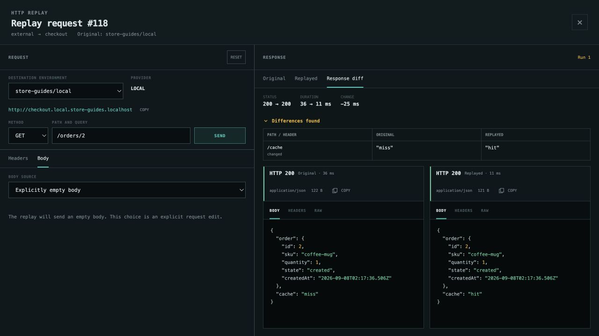
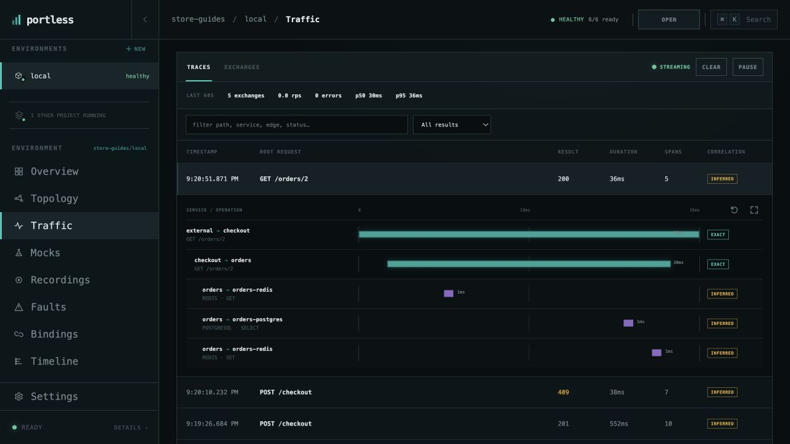
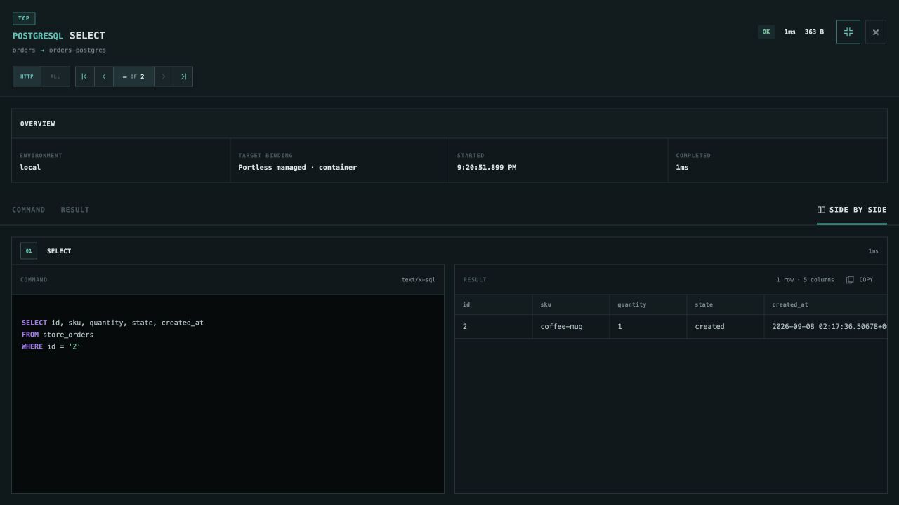
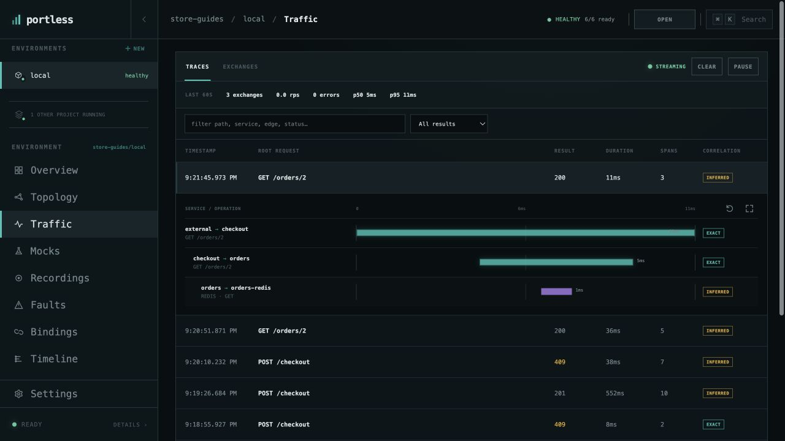

# Inspect database and cache activity

See which queries an application request caused and how caching changes that
work. Use the [running Store environment](run-application.md), with mocks and
faults disabled, and create a coffee mug order. Keep its order `id`.

## Look up the order twice

Retrieve the order through checkout, substituting your own ID:

```bash
curl http://checkout.local.store-guides.localhost/orders/2
curl http://checkout.local.store-guides.localhost/orders/2
```

Run the second request within 60 seconds. The first lookup reports
`"cache": "miss"`; orders reads PostgreSQL and fills Valkey. The second reports
`"cache": "hit"`. If the order was already cached, create a new order or wait
for its 60-second cache entry to expire before trying again.

You can also repeat the first captured lookup using **Replay trace → SEND**
in Traffic. **Response diff** then makes the `miss → hit` change visible:



## Inspect the cache miss

Open **Traffic → Traces**, leave the result filter on **All results**, and filter
for `/orders/2` (using your ID). Expand the first lookup. It contains a
**REDIS GET**, a **POSTGRESQL SELECT**, and a **REDIS SET**, alongside the HTTP
requests.



Select **orders → orders-postgres · POSTGRESQL SELECT**. Open the detail view
full screen and choose **SIDE BY SIDE** to see the SQL and returned rows.
**COMMAND** and **RESULT** also show those panes separately. Use **COPY** above
the result table when you want its rows as CSV.



These are the application's captured queries and results. To issue a different
database query yourself, use your database client with the resource's public
endpoint from Overview.

## Compare the cache hit

Close the details and expand the second lookup. It has a **REDIS GET** without
the PostgreSQL query or cache write. Select the Redis span to inspect its
command and result; Store uses a key such as `store:order:2`.



Portless labels database and cache trace relationships **inferred** because
these protocols do not carry the HTTP trace headers. Their caller and target
remain visible, so orders' PostgreSQL activity stays distinct from inventory's.

[All guides](README.md) · [Understand dependencies](dependencies.md)
