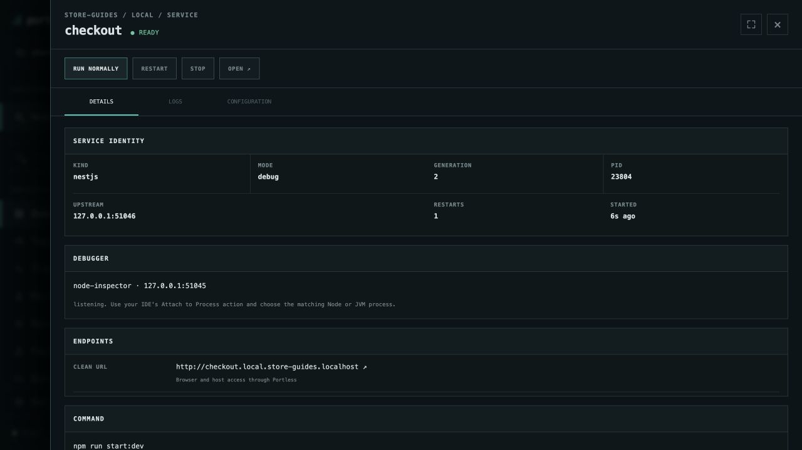
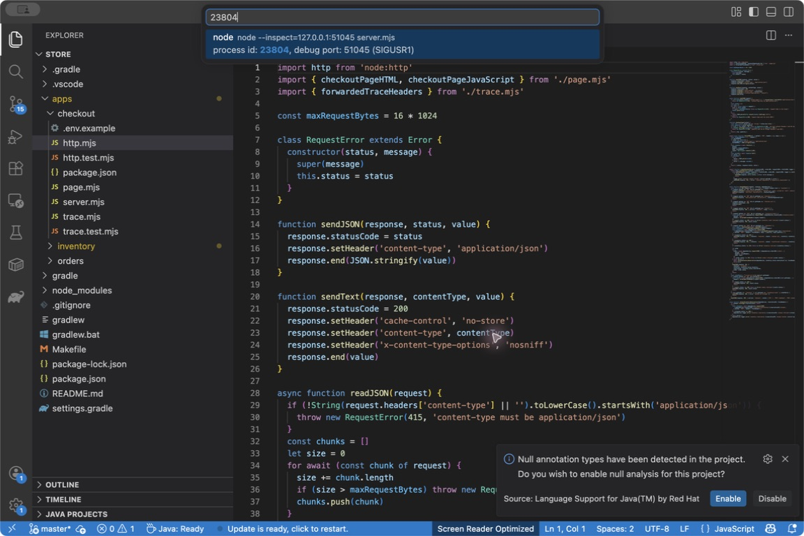
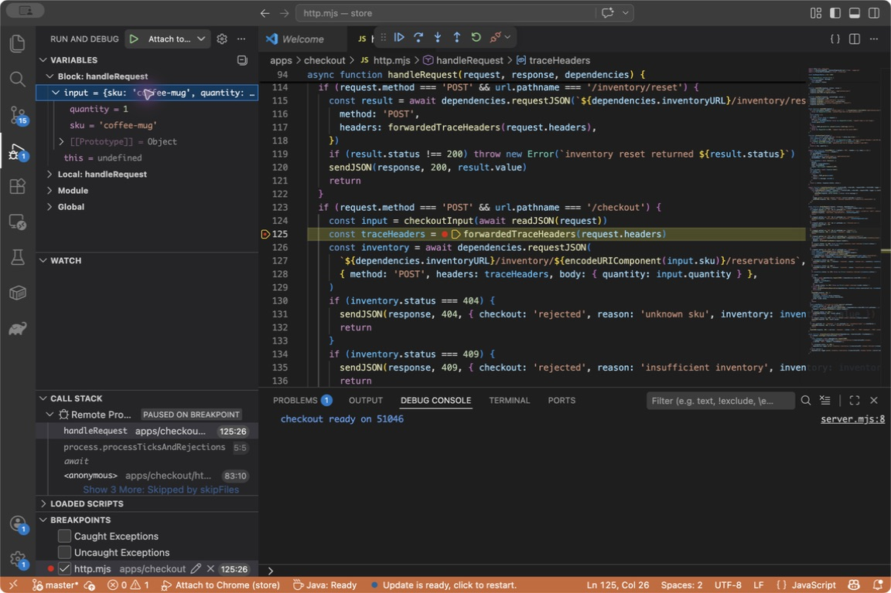
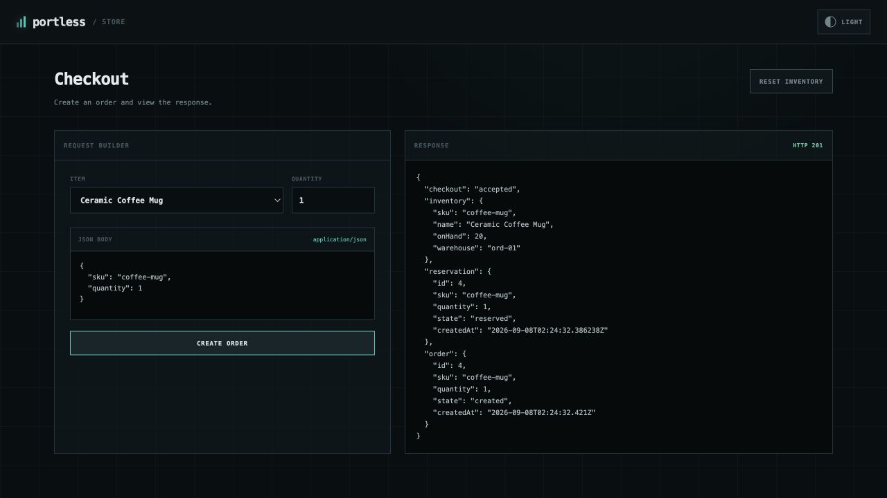
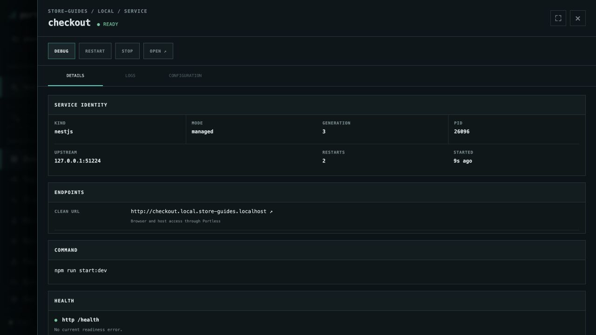

# Debug checkout with VS Code

Start checkout's debugger from Portless, attach VS Code to the running Node
process, and inspect an order before it calls inventory.

Start with [Store running](run-application.md) and VS Code installed. In VS Code,
open the Store folder used by this environment: `examples/store` if you followed
the first guide. **Bindings → Checkouts** shows the actual folder if you are
using another checkout or a cloned environment.

## Start debug mode in Portless

1. In **store-guides/local → Overview**, select **checkout**.
2. Choose **DEBUG** in its service drawer. Portless restarts checkout in debug
   mode while its dependencies remain available.
3. Wait for **ready**. Under **SERVICE IDENTITY**, note the **PID**. Under
   **DEBUGGER**, note the Node inspector address and the **listening** state.



The inspector port is assigned by Portless. Use the current address and PID;
the values in the screenshot are examples.

## Attach VS Code

1. Open the Command Palette: **Shift+Cmd+P** on macOS or **Ctrl+Shift+P** on Linux.
2. Run **Debug: Attach to Node Process**.
3. Filter the process picker by the PID from Portless. Verify that the result's
   debug port matches the inspector port, then select it.



VS Code's [Attach to Node Process action](https://code.visualstudio.com/docs/nodejs/nodejs-debugging#_attach-to-node-process-action)
connects to the process Portless started. No `launch.json` is needed for this
workflow. If you restart checkout, check its new PID and attach again.

## Pause on a checkout request

Open `apps/checkout/http.mjs` in VS Code. In `handleRequest`, find the
`POST /checkout` branch and set a breakpoint on this line by clicking its gutter
or placing the cursor there and pressing **F9**:

```js
const traceHeaders = forwardedTraceHeaders(request.headers)
```

This line runs just after the request body has been parsed into `input` and
before the inventory request begins.

Return to Store's checkout page, select **Ceramic Coffee Mug**, set **Quantity**
to `1`, and choose **CREATE ORDER**. VS Code pauses at the breakpoint.
In **Run and Debug → Variables**, expand **Block: handleRequest → input**.
You should see `sku: 'coffee-mug'` and `quantity: 1`. **Call Stack** identifies
the paused `handleRequest` frame.



The browser waits while the process is paused. Choose **Continue** or press
**F5** to let the request finish. Store returns **HTTP 201** with the new order.



## Return to normal operation

Choose **Disconnect** in VS Code's debug toolbar. Then return to checkout's
Portless service drawer and choose **RUN NORMALLY**. Wait for **ready** and
**MODE: managed**; the debugger section disappears and the public URL stays
the same.



For the CLI equivalent of entering debug mode, run
`portless up --env store-guides/local --debug checkout`. To return just checkout
to normal mode, use `portless service manage checkout --env store-guides/local`.

[All guides](README.md) · [Manage an individual service](manage-service.md)
