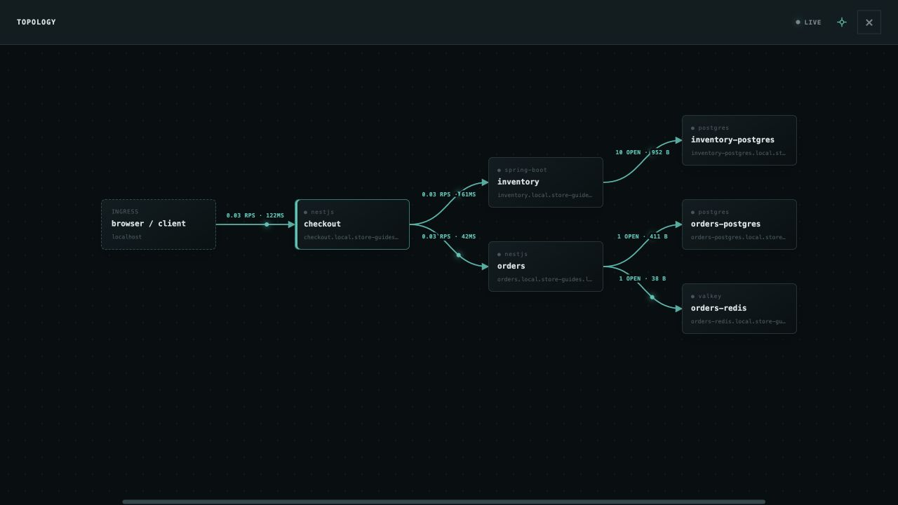
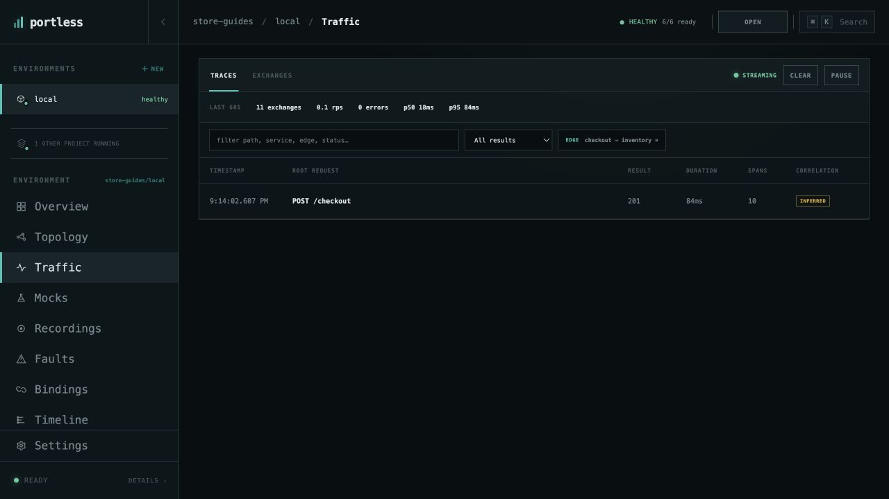

# Understand your application's dependencies

Use the topology to see how [Store](run-application.md) is connected and move
straight to traffic on the connection you care about.

## Read the topology

Open **store-guides/local → Topology**. Requests enter checkout, which calls
inventory and orders. Each of those services has its own PostgreSQL database;
orders also uses the Valkey resource named `orders-redis`.

Choose **Maximize topology** to give the graph the full window, as shown below.
**Center topology** brings all of the nodes back into view.

Each node shows the service's name, kind, readiness, and endpoint. Select a
service node to open its details and logs. Drag the canvas to pan and use
**Center topology** to bring the graph back into view.

## Follow one dependency connection

1. Open Store through **OPEN APP** and create a coffee mug order.
2. Return to **Topology** and select the connection from **checkout** to
   **inventory**.
3. Portless opens **Traffic** with an **EDGE checkout → inventory** filter.
   In **Traces**, select the `POST /checkout` row to expand its waterfall.

The filter selects traces containing that connection. Expand a trace to see
the surrounding request path as well. **Exchanges** lists individual operations
when you want to inspect one HTTP request or database command directly.

The caller matters: **checkout → inventory** identifies requests from checkout
to inventory. This is also the connection you would select when
[adding a fault](test-failures.md). Select the **×** on the edge filter to return
to traffic for the whole environment.

HTTP spans can be correlated exactly through trace headers. Database and cache
operations may be marked **inferred** because Portless relates them by caller
and timing rather than an HTTP trace header.

[All guides](README.md) · [Investigate a failed request](investigate-failed-request.md)
