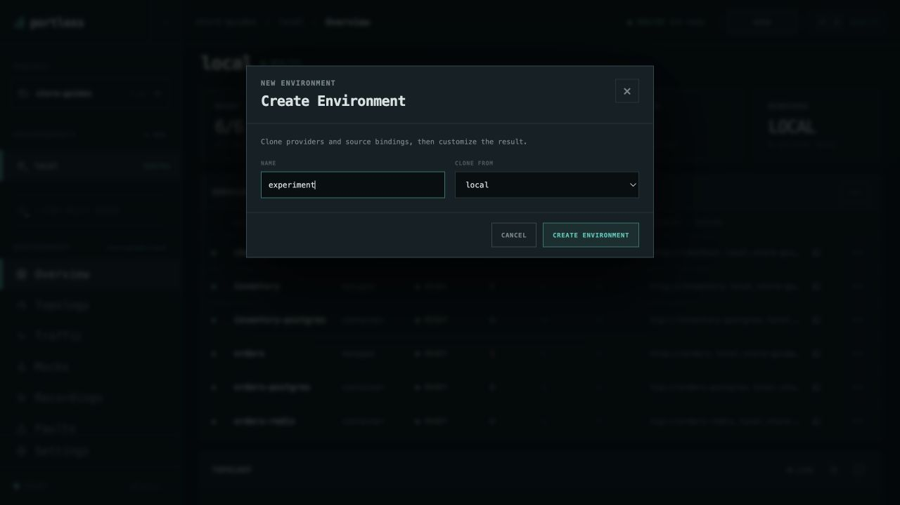
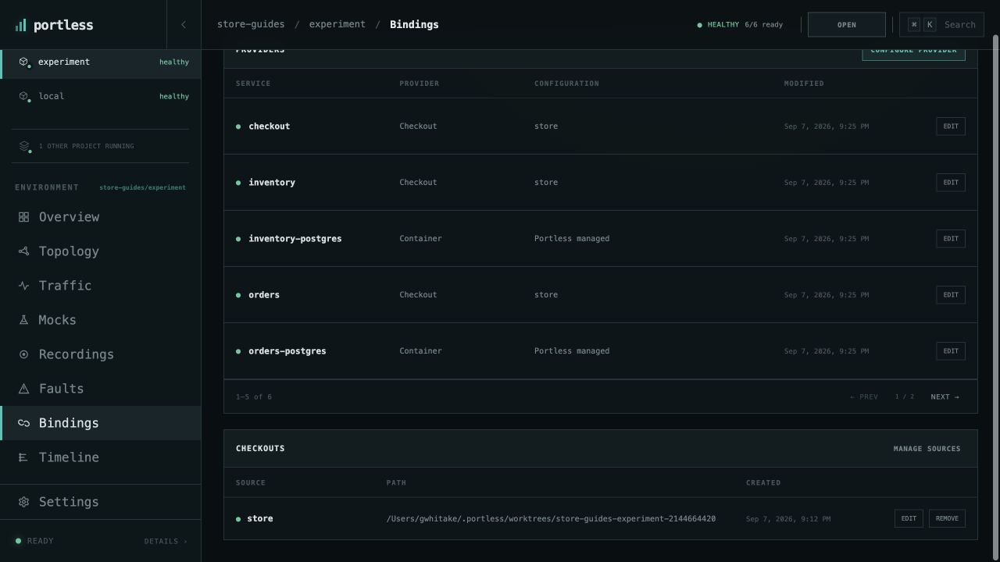
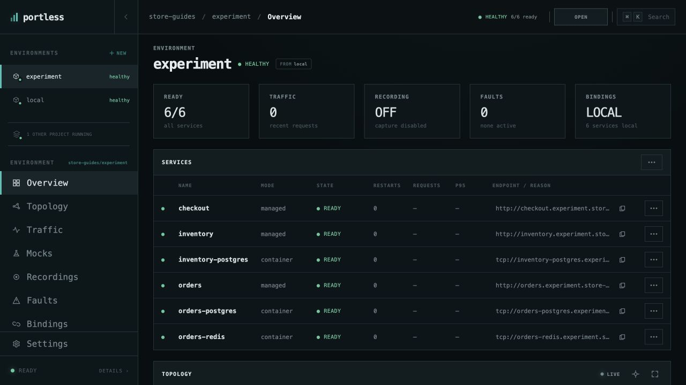

# Create and switch environments

Run a second instance of Store with its own configuration, source checkout,
and managed data. Start with [store-guides/local running](run-application.md).
The source must be a Git checkout with an existing commit for automatic
worktree preparation; the cloned Portless repository meets that requirement.

## Clone the configuration

Choose **+ NEW** beside **Environments** in the left navigation. Set **NAME**
to `experiment`, leave **CLONE FROM** on `local`, and choose
**CREATE ENVIRONMENT**.



The new **store-guides/experiment** environment opens in a stopped state.
Its overview identifies `local` as the source. Providers and source bindings
are copied, and later configuration changes are independent. This is a
configuration clone; it does not copy your existing database contents.

## Start and inspect the clone

Choose **Start All** and wait for **healthy · 6/6 ready**. Because `local` is
already using the original source checkout, Portless prepares a separate Git
worktree for `experiment`, including current uncommitted files and installed
dependencies. Later edits stay in their respective checkouts.

Open **Bindings**. **PROVIDERS** lists how each service runs, and **CHECKOUTS**
shows the source folder used by this environment. Open that folder in your
editor when working on the clone.



The three application services use a **Checkout** provider; the databases and
cache use **Container** providers. Use **EDIT** beside a provider when you want
to change how that service runs. See the [provider reference](../portless-cli/COMMANDS.md#environment-selection-and-configuration)
for the available choices.

## Switch between environments

Choose **Overview**, then **OPEN APP**. The clone's checkout has its own address:

```text
http://checkout.experiment.store-guides.localhost
```



Select **local** or **experiment** in the left navigation to change which
environment the dashboard controls. Check the header before sending traffic,
enabling a mock, or restarting a service. Switching the dashboard leaves the
other environment running.

The original checkout stays at `http://checkout.local.store-guides.localhost`.
Each environment's Store databases begin and persist independently. A new
`experiment` does not contain the orders created in `local`.

## Stop the extra instance

With **experiment** selected, open **Overview → Services actions → STOP ALL**
and choose **CONFIRM**. This stops the clone while preserving its managed data.
Select **local** to continue working in the original environment.

Browser navigation does not choose the target for commands in your terminal.
Use an explicit selector there, such as
`portless status --env store-guides/experiment`.

[All guides](README.md) · [Debug the selected checkout](debug-checkout-vscode.md)
