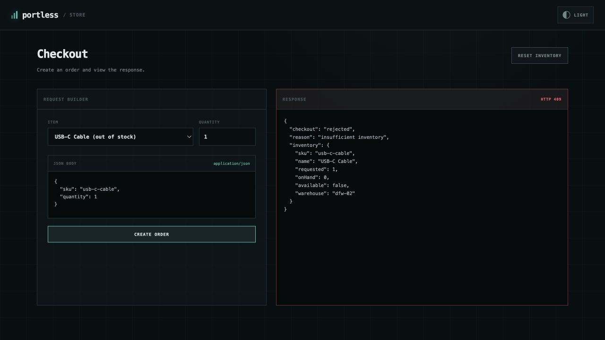
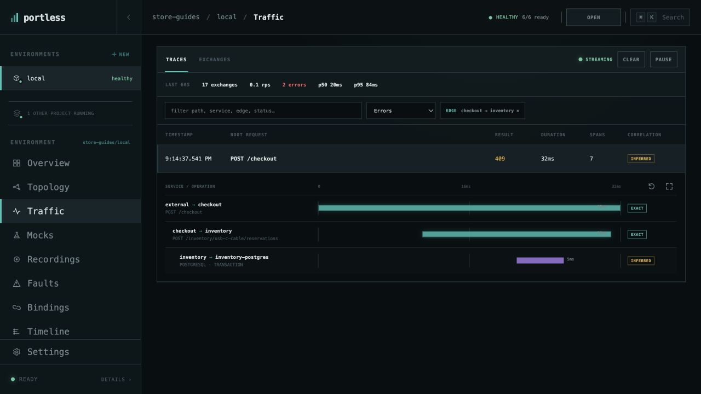
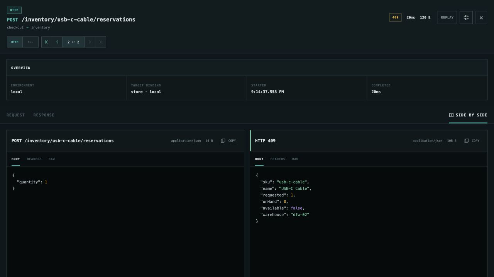

# Investigate a failed request

Follow a rejected checkout from the browser to the dependency that explains it.
Use the [running Store environment](run-application.md), with mocks and faults
disabled.

## Reproduce the failure

In Store's checkout page, select **USB-C Cable (out of stock)**, set **Quantity**
to `1`, and choose **CREATE ORDER**. The page returns **HTTP 409** with
`"checkout": "rejected"` and `"reason": "insufficient inventory"`.

## Follow the trace

1. Open **store-guides/local → Traffic → Traces**.
2. Set the result filter to **Errors**. Clear any unrelated service or edge
   filter if your request is missing.
3. Select the recent **POST /checkout · 409** row to expand it.

The waterfall shows checkout calling
`POST /inventory/usb-c-cable/reservations`. Inventory checks its database and
rejects the reservation. This request does not proceed to orders.

## Read the dependency response

Select the **checkout → inventory** span. Choose **Full screen traffic details**
and **SIDE BY SIDE**, then **BODY** in each pane to compare the request and
response. The request asks for one item; the **409** response reports
`"onHand": 0` and `"available": false`.

That response explains the checkout failure. **HEADERS** and **RAW** provide
additional context when the issue involves request metadata or formatting.
Use the span navigation controls to move back to checkout's response or on to
other operations. Select **ALL** to include database and cache spans in that
navigation.

To exercise a successful request, select **Ceramic Coffee Mug** in Store.
The USB-C cable is deliberately out of stock in the seed data; resetting
inventory leaves that example failure available.

[All guides](README.md) · [Edit and replay this request](replay-http.md)
