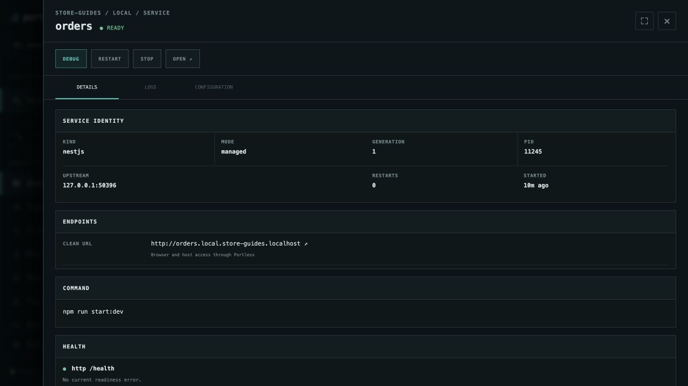
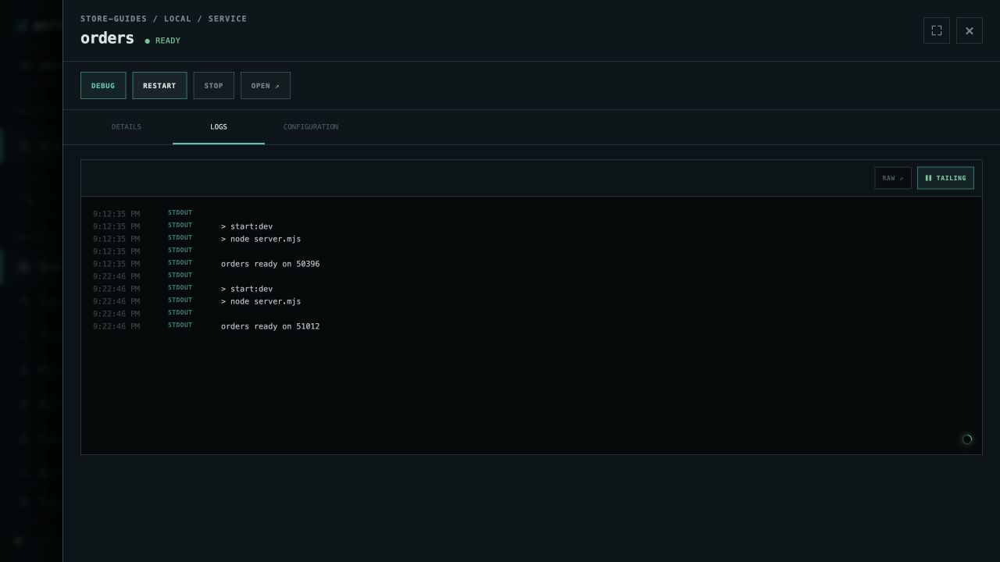

# Manage an individual service

Inspect health and logs, then restart only the service you are working on.
This walkthrough uses **orders** in the [running Store environment](run-application.md).

## Inspect the service

In **store-guides/local → Overview**, select **orders**. Its **details** view
shows the current mode, process ID, restart count, command, public endpoint,
and health check. For this example, readiness is checked at `/health`.

Use **OPEN** to visit the service, or copy its endpoint from the overview's
services table. The public address stays the same even when the process ID
and its private listening port change.

## Follow logs and restart

1. Select **logs** in the drawer. **TAILING** means new log lines appear live.
   Pause the tail when you need to read a particular section.
2. Choose **RESTART**. Lifecycle controls are temporarily disabled while the
   operation runs.
3. Wait for **ready**. The log shows a new `orders ready on …` entry. In
   **details**, the process ID and restart count reflect the restart.

Checkout, inventory, and the managed databases remain running. Existing orders
remain in PostgreSQL. Create another order from Store's checkout page or
retrieve an existing order to check the application after your change.

If the service does not become ready, read its health message and logs, correct
the reported application problem, and retry. **configuration** shows the command
and settings Portless uses. **STOP** and **START** let you pause and resume this
one service when a full restart is not what you need.

[All guides](README.md) · [Debug checkout with VS Code](debug-checkout-vscode.md)
