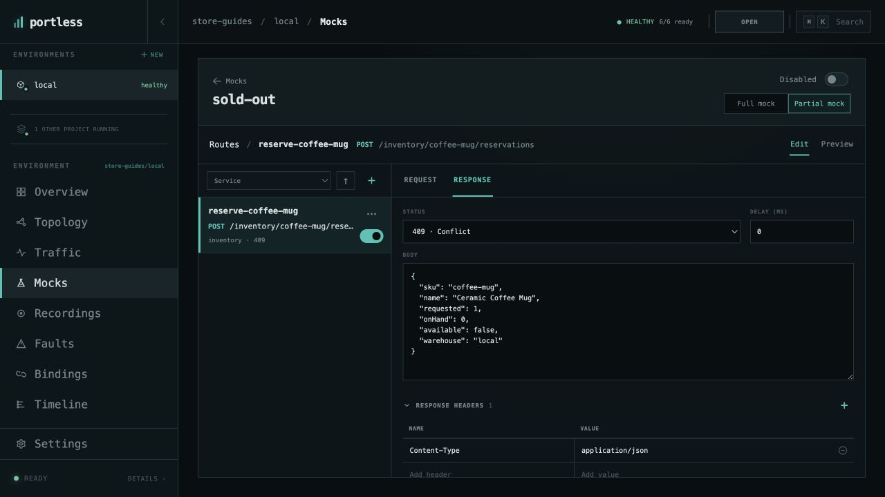
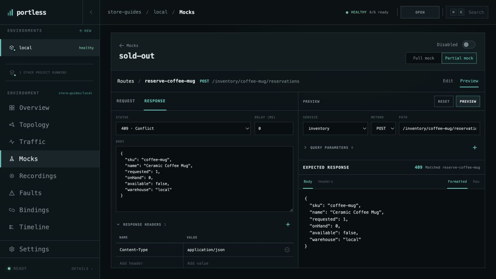
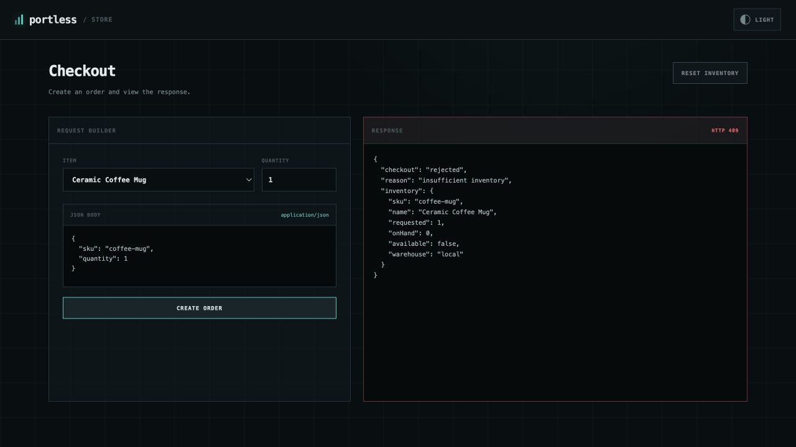

# Mock a dependency

Make inventory report that coffee mugs are sold out, then restore live behavior.
Use the [running Store environment](run-application.md) with no other mock
scenario enabled.

## Create a partial mock

Open **store-guides/local → Mocks → CREATE SCENARIO**. Name it `sold-out`,
choose **Partial mock**, and create it. A partial mock forwards unmatched
requests to the real service. A full mock returns `501` for unmatched requests.

Choose **ADD ROUTE**. On **Request**, set:

| Field | Value |
| --- | --- |
| Route name | `reserve-coffee-mug` |
| Service | `inventory` |
| Method | `POST` |
| Path match | `Exact` |
| Path | `/inventory/coffee-mug/reservations` |

On **Response**, choose **409 · Conflict**, leave the delay at `0`, and keep the
`Content-Type: application/json` response header. Enter this response body:

```json
{
  "sku": "coffee-mug",
  "name": "Ceramic Coffee Mug",
  "requested": 1,
  "onHand": 0,
  "available": false,
  "warehouse": "local"
}
```

Choose **SAVE ROUTE**. The route is on, but the scenario remains disabled until
you enable it.



## Preview the match

Select **Preview** above the editor. Keep the preview's service, method, and
path set to this inventory reservation request, then choose **PREVIEW**.
The expected response should say **409** and **Matched reserve-coffee-mug**.
Preview checks the mock without sending a request to your application.



## Enable and exercise it

Turn the `sold-out` scenario switch **On** and wait for **Enabled**. In Store's
checkout page, select **Ceramic Coffee Mug**, set **Quantity** to `1`, and choose
**CREATE ORDER**. Checkout now returns **HTTP 409**, with the mock's
`"warehouse": "local"` response identifying the simulated inventory result.



The matching request was answered by the mock, so it did not consume real stock.
Keep both the scenario and its route on while testing this case.

## Restore inventory

Return to **Mocks → sold-out** and turn the scenario **Off**. Wait for
**Disabled**, then create a coffee mug order again. With stock available, it
returns **201** using the real inventory service. The saved scenario remains
available for another run.

[All guides](README.md) · [Test a slow dependency](test-failures.md)
