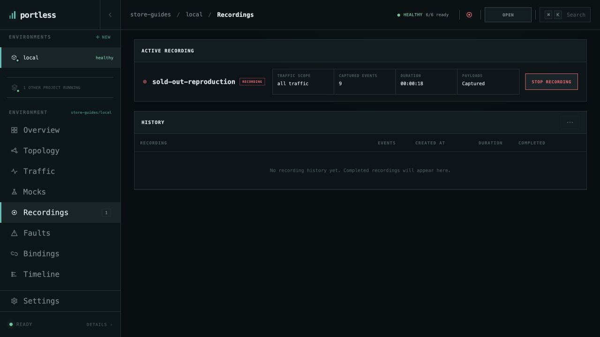
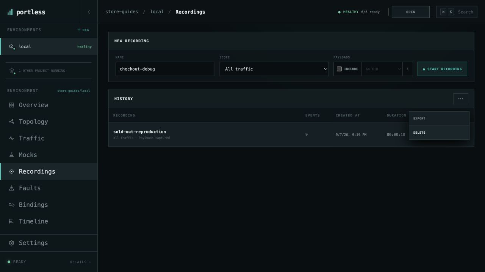

# Record a reproduction

Capture a short, named session that you can export after reproducing a problem.
This walkthrough records Store's out-of-stock checkout response.

Use the [running Store environment](run-application.md) with mocks and faults
disabled, so the failure comes from its seed inventory data.

## Start recording

1. Open **store-guides/local → Recordings**.
2. Set **NAME** to `sold-out-reproduction` and leave **SCOPE** on **All traffic**.
   A specific connection is useful when you need a narrower capture.
3. Select **INCLUDE** under **PAYLOADS**, leaving the maximum at **64 KiB**.
   This example uses synthetic order data. Payloads may contain application
   data, so choose this option deliberately for your own application.
4. Choose **START RECORDING**.

The active view shows the scope, elapsed time, and captured event count. The
environment header also indicates that a recording is running.

## Reproduce and stop

In Store's checkout page, select **USB-C Cable (out of stock)**, set **Quantity**
to `1`, and choose **CREATE ORDER**. Check that it returns **HTTP 409**, then
return to Recordings. The event count should have increased.

Choose **STOP RECORDING**. The completed recording moves into **HISTORY**,
showing its event count and duration. Stopping capture leaves the application
running.

## Export the session

Open the completed recording's actions menu and choose **EXPORT**. Portless
downloads `sold-out-reproduction.json` through your browser.

Review the export before sharing it, especially if you included payloads.
For command-line inspection and reuse, see the
[recording commands](../portless-cli/COMMANDS.md#recordings).
The history row's **DELETE** action removes a saved recording when you no
longer need it.

[All guides](README.md) · [Investigate a failed request](investigate-failed-request.md)
