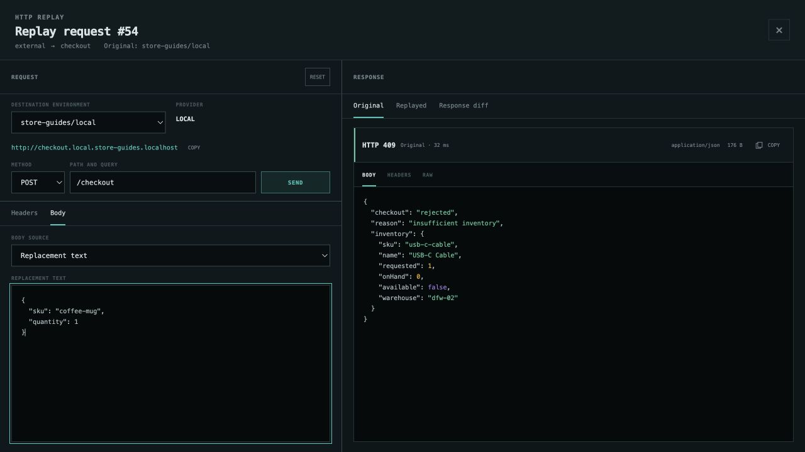
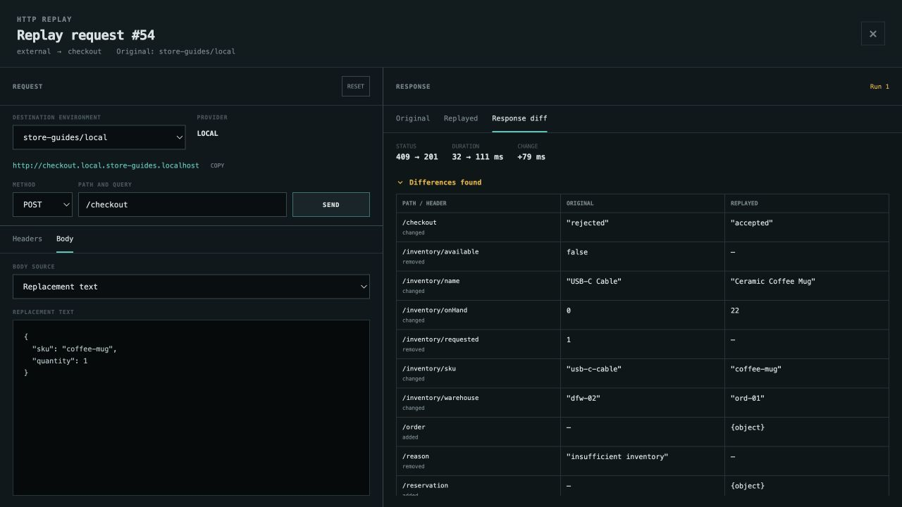

# Edit and replay an HTTP request

Turn an out-of-stock checkout into a successful request without reconstructing
it from scratch. Start with [Store running](run-application.md), then create
the USB-C cable failure from [Investigate a failed request](investigate-failed-request.md).
Keep mocks and faults disabled.

## Open the captured request

In **store-guides/local → Traffic → Traces**, expand the failed
**POST /checkout · 409** trace. Select its **external → checkout** span and
choose **REPLAY**. The waterfall's **Replay trace** action also opens the root
request directly.

The editor identifies the caller, target service, and original environment.
Keep **DESTINATION ENVIRONMENT** set to **store-guides/local**, **METHOD** set
to **POST**, and **PATH AND QUERY** set to `/checkout`.

## Change the body

Select **Body**, choose **Replacement text**, and enter:

```json
{
  "sku": "coffee-mug",
  "quantity": 1
}
```



**Headers** lets you edit or omit individual headers. Captured credentials may
be redacted; provide a valid value or omit the header when appropriate for your
application.

## Send and compare

Choose **SEND**. This sends a real request to the selected environment: this
successful checkout reserves stock and creates an order there.

**Response diff** shows the original **409** becoming **201**, along with
changes such as `checkout: "rejected" → "accepted"`. **Original** and
**Replayed** let you read either complete response, including headers and raw
content.



The new request also appears in Traffic. You can send again after another edit,
or close the replay editor when finished. Each successful send creates another
order; **RESET** restores the editor's captured request, not application data.

A ready environment in the same project can be selected as a different
destination. See [Create and switch environments](environments.md) to prepare
one with independent data.

[All guides](README.md) · [Mock a dependency](mock-dependency.md)
