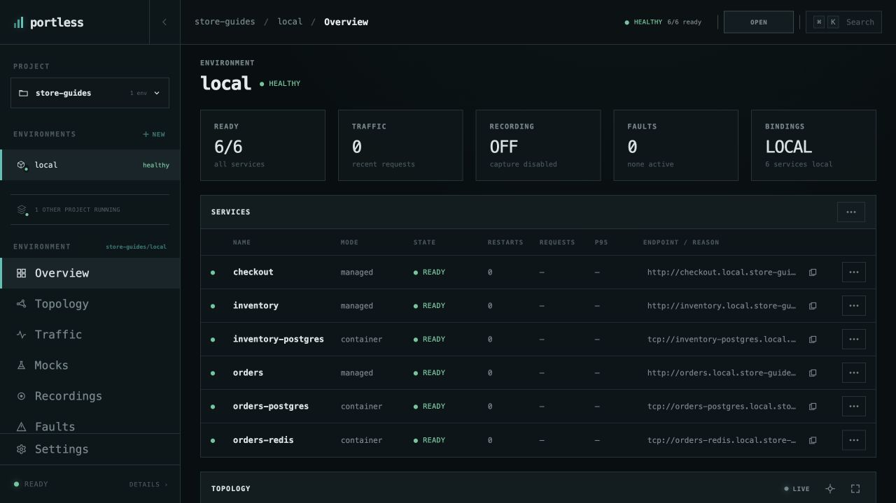
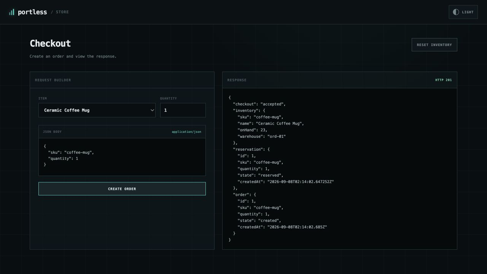
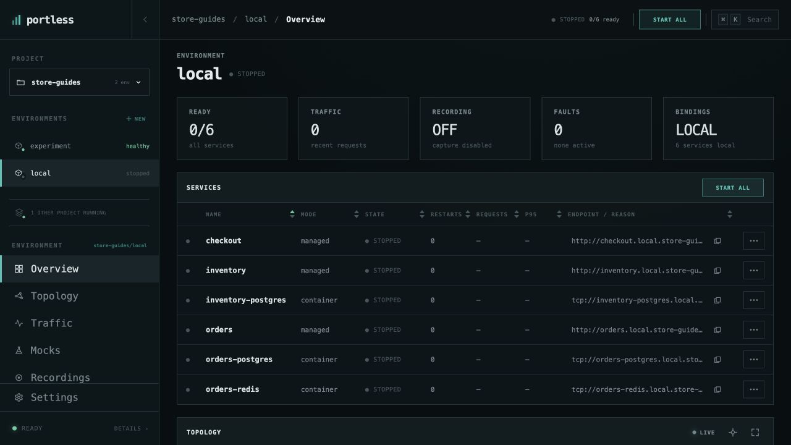

# Run your first application

Start Store, create an order, and find your way around the Portless dashboard.
Store includes Node.js checkout and orders services, a Spring Boot inventory
service, two PostgreSQL databases, and a Valkey cache.

## Before you start

[Install Portless and complete its one-time setup](../README.md#install).
Store also needs Node.js 22.12 or newer, Java 17 or newer, npm, Make, and a
running Docker or Podman engine.

Use the [Portless repository](https://github.com/runportless/portless) checkout
from the installation instructions. From its root, install Store's dependencies
and start the application:

```bash
make example-store-dependencies
cd examples/store
portless up --name store-guides
```

The first run may take longer while Java dependencies and container images
download. Portless discovers the application from its files and opens the
dashboard. No application configuration file is required.

## Open the application

1. Check that the dashboard header says **store-guides / local**.
2. Wait for **healthy** and **6/6 ready**. The services table shows three
   application services and three managed container resources.
3. Choose **OPEN APP** in the header to open Store's checkout page.



The checkout address is `http://checkout.local.store-guides.localhost`.
Portless keeps this address stable when the process restarts.

On the checkout page, select **Ceramic Coffee Mug**, leave **Quantity** at `1`,
and choose **CREATE ORDER**. A successful request returns **HTTP 201** with
`"checkout": "accepted"`, a reservation, and an order. Keep the order's `id`
for the [database and cache guide](database-and-cache.md).



## Find the right view

Use the left navigation to move between tasks:

| View | Use it to |
| --- | --- |
| Overview | Check readiness and open an individual service's details or logs. |
| Topology | See services and their dependency connections. |
| Traffic | Follow a request and inspect HTTP, database, and cache activity. |
| Mocks and Faults | Test specific dependency responses or failures. |
| Recordings | Capture a reproduction for later use. |
| Bindings | See providers and the source checkout used by the environment. |
| Timeline | Review changes such as starting a recording or enabling a mock. |

`portless ui --env store-guides/local` reopens the dashboard later.

## Stop and resume

In **Overview**, open the **Services actions** menu beside **SERVICES**, choose
**STOP ALL**, then **CONFIRM**. Wait for **stopped**. Ordinary stops preserve
the managed data volumes, including your orders and remaining inventory.



Choose **Start All** and wait for **6/6 ready** to resume. The same public URLs
work again. You can retrieve your saved order to check that its data survived:

```bash
# Replace 1 with the order ID returned by your checkout request.
curl http://checkout.local.store-guides.localhost/orders/1
```

The CLI equivalents are `portless down --env store-guides/local` and
`portless up --env store-guides/local`. Leave the environment running when
continuing with another guide.

Next: [Debug checkout with VS Code](debug-checkout-vscode.md) or
[understand the dependencies](dependencies.md).
