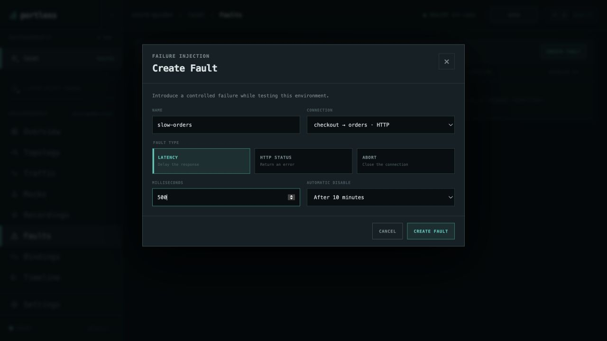
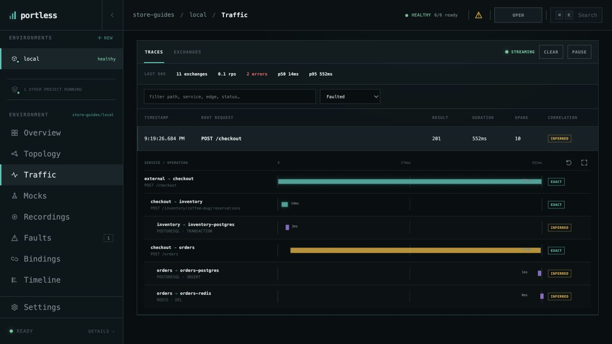

# Test a slow dependency

Add 500 ms to calls from checkout to orders and see the effect in a trace.
Start with [Store running](run-application.md), no active faults, and mocks
disabled so the request reaches the real services.

## Add the delay

Open **store-guides/local → Faults → CREATE FAULT** and set:

| Field | Value |
| --- | --- |
| Name | `slow-orders` |
| Connection | `checkout → orders · HTTP` |
| Fault type | `Latency` |
| Milliseconds | `500` |
| Automatic disable | `After 10 minutes` |

Choose **CREATE FAULT**. The new fault is active immediately, and the environment
header shows an active-fault indicator. Only the selected connection is affected.

## Observe a request

Create a coffee mug order from Store's checkout page. It should still succeed
with **201**, but take longer. Open **Traffic → Traces**, choose **Faulted** in
the result filter, and expand the new `POST /checkout` trace.

In this capture the **checkout → orders** span takes 524 ms, while inventory's
reservation takes 14 ms. Your timings will vary; the selected connection should
include approximately the added 500 ms. The **Slow · 500ms+** filter is another
way to find the request.

## Remove the effect

Return to **Faults** and turn `slow-orders` **Off**. Its active indicator
disappears. Submit another order and compare the new trace using **All results**.
The saved fault can be enabled again, and the automatic expiry provides a
backstop if you forget to disable it.

The same dialog also offers **HTTP status** for a fixed error and **Abort** for
a closed connection. Use separate named faults when exploring those behaviors.

[All guides](README.md) · [Record a reproduction](record-reproduction.md)
